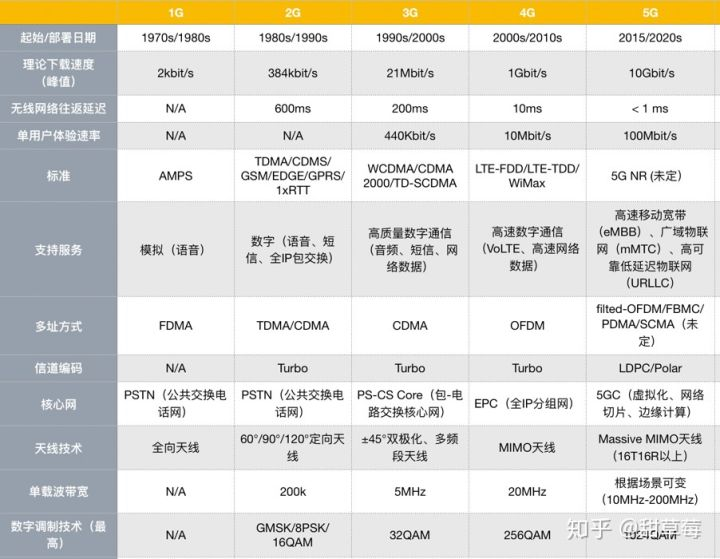
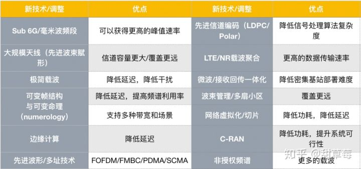

#5g

普通用户对5G充满希望，许多人认为它将是一场变革 – 改进的用户体验、新的应用、新的商业模式和新的服务将伴随着千兆比速率、低延迟、大容量、低能耗更加先进的网络性能和可靠性应运而生。然而，运营商和一些通信行业人士却对商业案例持怀疑态度- 5G技术尚不成熟、部署5G需要大量投资，警告声不绝于耳。ITU发布的报告中[2]曾估计，在假设光纤回程在商业上可行的情况下，5G部署成本可从小城市的680万美元到人口密集大城市的5550万美元不等；而单站的部署成本大约在20000美元到50000美元之间(注：这里提到的成本是投资成本CAPEX，不包含长期运维成本)。 国际电信联盟（ITU）在2015年9月发布M.2083-0号建议[1]时（面向2020年及之后的国际移动通信结构和目标），时任电信发展局主任的布哈伊马•萨努就已经意识到他们正在揭开一场波澜壮阔却又争议丛生的通信行业新篇章。

##移动通信系统演进 

自从人类社会诞生以来，如何高效、快捷、可靠地传输信息始终是人类矢志不渝的追求。从文字到印刷术，从欧洲古老的光信号塔到现代无线电，从手工转接电话到宽带移动互联网，可以这么认为，现代科技发展速度一直被信息传播速度所直接影响。从这个角度来看，现在商用移动通信网络或许能被称作全球信息传播系统中的最重要组成部分。 它的影响潜移默化，时至今日虽然很多人都因为信息爆炸而憧憬车马邮件都慢的古铜色历史，但如果真的没有网络，没有信号，我想大部分人的工作和生活都会无法正常进行。 与此同时，有一种观点这么认为，移动通信系统现象级的成功主要来自于极为快速的技术创新和迭代。从20世纪70年代初贝尔实验室研制出第一代移动通信系统（先进移动电话系统，AMPS）到21世纪初的第四代移动通信系统，移动通信系统已经完成了从模拟通信到数字通信、从纯电路交换到全IP交换、从CDMA到OFDM的数次技术更新，每一次更新都带来了更快的速度、更低的延迟和更多的特性，也带来了更好的用户体验

实际上，为了统一全球通信标准以方便用户国际漫游等需求，自从3G以来，ITU一直致力于从各地区的工作小组和工作论坛中搜集整理未来通信行业需要解决的问题，并每十年左右发布一次官方建议文件，作为此代通信系统的设计目标，并从全世界收集符合该目标的技术标准，这些标准通常由类似3GPP或者IEEE的组织制定提交，由ITU验证评估。可以认为这些快速迭代的建议目标是符合当下未来十年的通信需求的。当然，因为商业和政策问题，当存在竞争标准时，符合这些目标的标准集合不一定会完全成功，两个非常典型的例子就是TD-SCDMA和WiMax。

那为什么ITU需要发布IMT-2020（5G）建议？ 一些数据可能能够说明问题：截止2016年底，LTE系统已经覆盖了21.7亿人，包含世界上大部分国家地区 ，连接数几乎以每年翻倍的势头增长，2015年LTE的连接数达到十亿，预计到2021年可能达到43亿。如果想要用LTE系统同时服务物联网设备，那么2022年左右总连接数可能达到180亿，这已经完全超过了当前LTE系统的负载能力。 当然，一种比较简单粗暴的想法是直接增加基站，但是这样做又会带来很多新问题：在4G（IMT-Advance）的设计目标里，并没有考虑能耗和二氧化碳排放量等等问题；虽然3GPP提出的LTE系统有考虑物联网设备，但是物联网本身的关键性能也没有在4G的设计目标占据一席之地；更加严重的问题是，因为4G中技术选型、调制方式设置和单载波频带宽度等等问题，4G网络已经达到它设计之初的理论速度上限[2]，与之类似的还有频谱利用率，移动性，服务质量等等指标。

怎么才能才能设计一个通信系统达到5G预想的目标？4G本身是比较成功的，它已经建立了一个技术底线，那么怎么从浩如烟海的通信理论中找到可用的技术方案，据此提出标准提案，并让所有这些标准组合起来的整个系统性能可以达到ITU目标呢？更重要的是，要同时实现公司利益最大化？这或许是15年8月以来让加入3GPP的各大公司最头疼的事儿了。不同公司有不同的选择：有实力的通信公司会选择自己预研先进的通信技术，预先布局，然后根据自己的技术积累做出提案，而没有实力做太多预研的公司，或许需要考虑自己的利益最大化来选择提案支持。不过总体来说，有那么几种新技术是大家都看好的，就是很多文章都有提到的： 毫米波(mmWave)，大规模天线(massive MIMO)，网络虚拟化（NFV）/切片，改进的OFDM波形，Polar码，边缘计算，C-RAN。同时，优化4G系统也衍生出了很多新的设计方案，所以从目前（Rel 15）来看，整个5G的调整是这样的（如下表）：

在目前5G所采用的两种频段（sub 6G和毫米波）中，massive MIMO的使用方式和目的都有所不同。在sub 6G宏基站中，massive MIMO主要目的是尽量提供更多的复用增益，也就是尽量提供更多的独立数据流给各个用户，我们通常称这种工作场景为多用户MIMO（MU-MIMO）；而毫米波基站中，massive MIMO的主要目的是提高基站覆盖范围，弥补路径损耗，提高单个用户的信噪比和空间增益，我们通常称这种工作场景为单用户MIMO（SU-MIMO）。这两种目的决定了波束赋形和预编码的算法设计和硬件设计都略有不同。

先进信道编码(LDPC/Polar码)在所有数字通信系统中，信道编码和译码都是提高数据传输可靠性的重要组成部分。数字信号在传输过程中总会因为信道失真、噪声和干扰等影响，导致接收信号后译码产生误差，达不到实用要求。香农第二定理告诉我们，只要数据传输速率小于信道容量，就会存在一种编码，使误码率任意小。5G中新采用的LDPC码和Polar码就是目前性能优异的信道编码方案之二，它们都属于线性分组码。实际上当时5G中信道编码的候选方案有四种，其中三种最有竞争力：接近香农极限的Turbo码、LDPC码和达到香农极限的Polar码。注：2G,3G,4G时代一直在采用Turbo码，而LDPC码在WiFi、固定通信等场景中得到使用，Polar码则是近些年编码领域的新星。由于信道编码是物理层最基本的技术，信道编码方案对系统的性能有直接影响。在20Gbit/s的峰值速率要求目标下，系统对用户面和控制的延迟要求很高，信道编码的译码器单次译码延迟需要控制在几到几十ms以内，同时要求译码器有合理的芯片面积和功耗。根据5G系统对可靠性的要求，需要在eMBB场景在块误码率  以上没有错误平层，在URLLC场景场景在  块误码率以上没有错误平层。这个要求Turbo码很难满足，而且它的算法复杂度过高，虽然可以采用并行架构提升编译速度，但是随之而来的功耗提升和芯片计算能力要求也不利于实际使用。所以Turbo码是需要在5G标准中替换的。

