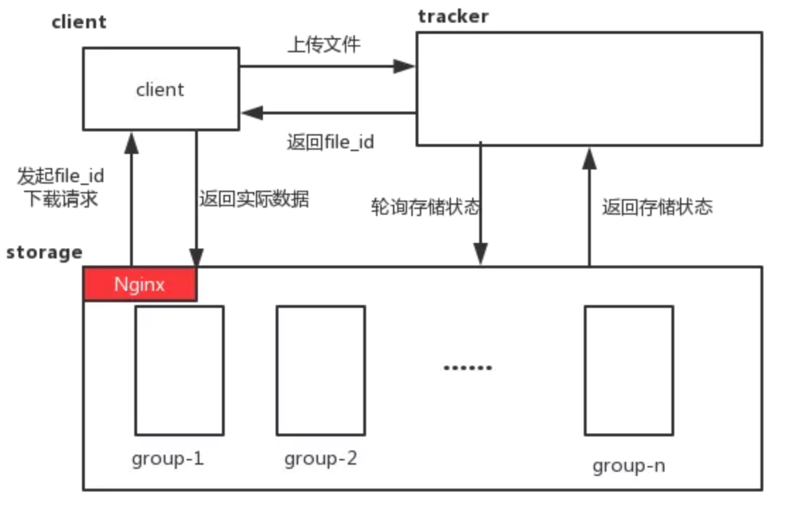

##服务环境背景话术

使用 Siege 和 ab 作为压测工具

siege 英[siːdʒ]

话术：https://v3u.cn/a_id_95

具体操作：https://v3u.cn/a_id_87

强调我们的日均pv在千万级，也就是每天的pv在1000万左右，日活(uv)在80万左右，QPS(每秒请求数)1000左右 峰值1200，时间段在晚上，因为晚上看视频的人多，并发数最高

而经过测试，我们单台服务器的极限值是300左右（uwsgi+django）

单台mysql连接数维持在1200个左右

所以nginx负载均衡部署了8台机器，其中两台作为备用机

mysql主从分离集群部署了4台从机，其中一台作为备用机

前端做了cdn缓存和做了gizp压缩 webpack优化，精简http请求数，视频缩略图延迟加载

基本在打出富裕(超出极限负载30%左右)的前提下，在高并发高负载环境下可以正常运营(但是不排除特殊情况下出现的宕机，比如ddos攻击)


##Linux查看系统负载常用命令

```
top   查看实时负载，3秒一刷新

cat /proc/cpuinfo ：即可查看CPU信息，几个processor即为几个CPU；

sar：可以监控系统所有资源状态，sar -n DEV查网卡流量历史、sar -q 查看历史负载，最有用的就是查网卡流量，流量过大：rxpck/s大于4000,或者rxKB/s大于5000，则很有可能被攻击了，需要抓包分析；

free：查看当前系统的总内存大小以及使用内存的情况；

ps：查看进程，ps aux 或者 ps -elf，常和管道符一起使用，查看某个进程或者它的数量；

netstat：查看端口，netstat -lnp用于打印当前系统启动了哪些端口，netstat -an用于打印网络连接状况；

tcpdump：抓包工具分析数据包，知道有哪些IP在攻击；可以将内容写入指定文件1.cap中，显示包的内容，不加-w屏幕上显示数据流向；

wireshark：抓包工具，可以临时用该命令查看当前服务器上的web请
```

##自动化运维系统

###背景

在软件开发生命周期中，遇到了两次瓶颈。第一次瓶颈是在需求阶段和开发阶段之间，针对不断变化的需求，对软件开发者提出了高要求，后来出现了敏捷方法论，强调适应需求、快速迭代、持续交付。第二个瓶颈是在开发阶段和构建部署阶段之间，大量完成的开发任务可能阻塞在部署阶段，影响交付，于是有了自动化运维系统(DevOps)。

DevOps的三大原则：

1、基础设施即代码（Infrastructure as Code）
DeveOps的基础是将重复的事情使用自动化脚本或软件来实现，例如Docker（容器化）、Jenkins（持续集成）、Puppet（基础架构构建）、Vagrant（虚拟化平台）等

2、持续交付（Continuous Delivery）
持续交付是在生产环境发布可靠的软件并交付给用户使用。而持续部署则不一定交付给用户使用。涉及到2个时间，TTR（Time to Repair）修复时间，TTM（Time To Marketing）产品上线时间。要做到高效交付可靠的软件，需要尽可能的减少这2个时间。部署可以有多种方式，比如蓝绿部署、金丝雀部署等。

3、协同工作（Culture of Collaboration）
开发者和运维人员必须定期进行密切的合作。开发应该把运维角色理解成软件的另一个用户群体。协作有几个的建议：1、自动化（减少不必要的协作）；2、小范围（每次修改的内容不宜过多，减少发布的风险）；3、统一信息集散地（如wiki，让双方能够共享信息）；4、标准化协作工具（比如jenkins）

在很多初创公司和中小型企业里，运维还停留在“刀耕火种”的原始状态，这里所说的“刀”和“火”就是运维人员的远程客户端，例如SecureCRT和Windows远程桌面。

在这种工作方式下，服务器的安装、初始化，软件部署、服务发布和监控都是通过手动方式来完成的，需要运维人员登录到服务器上，一台一台去管理和维护。这种非并发的线性工作方式是制约效率的最大障碍。

同时，因为手动的操作方式过于依赖运维人员的执行顺序和操作步骤，稍有不慎即可能导致服务器配置不一致，也就是同一组服务器的配置上出现差异。有时候，这种差异是很难直接检查出来的，例如在一个负载均衡组里面个别服务器的异常就很难发现。

随着业务的发展，服务器数量越来越多，运维人员开始转向使用脚本和批量管理工具。脚本和批量管理工具与“刀耕火种”的工作方式相比，确实提升了效率和工程质量。

###项目地址

版本库地址：
https://gitee.com/QiHanXiBei/spug/tree/master

演示地址：
https://spug.qbangmang.com  用户名:admin 密码:spug

具体功能话术：

User 用户管理

Rbac 权限管理

CMDB 资产管理

也就是服务器管理 通过后台对服务器集群进行管理

其中可以对服务器进行配置，远程命令行连接，连接服务器挂载的docker服务器，对docker映射端口号进行修改和配置


Task 任务计划管理

可以对计划任务进行配置和管理，例如发送邮件，发送短信，定时重启服务等等

CI/CD 部署、发布管理

集成jenkins，将冗长的代码拉取，克隆完全编程在网页端一键式的部署流程

Config File 配置文件管理

对项目的config文件统一管理，对重要文件做到一键式迁移

Monitor 监控

对服务器监控，监控服务器的cpu和内存占用

集成supervisor对后台服务做监控，是否宕机，服务进程监控

对站点监控，对集群网站的带宽以及http请求进行监控

Alarm 报警

如果出现数据异常或者内存占用过高，cpu占用过高的情况，磁盘空间不够等紧急情况

进行发邮件或者短信预警

##工单系统

1、解决的问题

　　　　　　1. 工作流程不统一，大量复杂工作流程，让人眼花缭乱（工单的边界比较模糊）。

　　　　　　2. 邮寄审批严重耗时、效率低下（特别是很多大部门leader被淹没在邮件中）。

　　　　　　3. 多部门协同工作，进度无法把控（到处拉群讨论）。

　　　　　　4. 大量人员每天做重复性工作，严重浪费人力成本。

2、工单系统模块

　　　　1） 用户管理

　　　　　　　　用户表、部门表、角色表  （设置代理人）

　　　　2）工单模板配置

 　　　　　　　　工单模板配置 ==》 审批流程配置   ==》  自动化工单配置

　　　　3）工单实例化

　　　　　　　　申请人工单           (审批中、被退回、完成) 

　　　　　　　　审批人子工单     （待处理、通过、退回、否决、确认）

　　　　　　　　自动化工单         （待执行、完成、执行异常）

　　　　4）工单通知

　　　　　　　　邮件、企业微信、超时报警

　　　　5）移动审批

 　　　　　　　　企业微信审批

　　　　6）工单报表

 　　　　　　　　工单类型、工单处理量、满意度统计


##Fastdfs

FastDFS是一个开源的分布式文件系统，它对文件进行管理，功能包括：文件存储、文件同步、文件访问（文件上传、文件下载）等，解决了大容量存储和负载均衡的问题。特别适合以文件为载体的在线服务，如相册网站、视频网站等等。可以说它就是为互联网而生，为大数据而生的。

FastDFS服务端有两个角色：跟踪器（tracker）和存储节点（storage）。跟踪器主要做调度工作，在访问上起负载均衡的作用。 存储节点存储文件，完成文件管理的所有功能：存储、同步和提供存取接口，FastDFS同时对文件的meta data进行管理。跟踪器和存储节点都可以由多台服务器构成。跟踪器和存储节点中的服务器均可以随时增加或下线而不会影响线上服务。其中跟踪器中的所有服务器都是对等的，可以根据服务器的压力情况随时增加或减少。



1 解决海量存储，同时存储容量扩展方便。

2 解决文件内容重复,如果用户上传的文件重复(文件指纹一样)，那么系统只有存储一份数据，值得一提的是，这项技术目前被广泛应用在网盘中。

3 结合Nginx提高网站读取图片的效率。

具体搭建：https://v3u.cn/a_id_78
通过python交互：https://v3u.cn/Index_a_id_79


其排重原理为：

FastDFS的storage server每次上传均计算文件的hash值，然后从FastDHT服务器上进行查找比对，如果没有返回，则写入hash，并将文件保存；如果有返回，则建立一个新的文件链接（软链），不保存文件。

##自动化部署 Jenkins

Jenkins是目前非常流行的一款持续集成工具，可以帮助大家把更新后的代码自动部署到服务器上运行，整个流程非常自动化，你可以理解为部署命令操作的可视化界面。

部署流程:https://v3u.cn/a_id_84