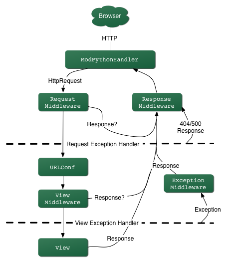

##Django 、Flask、Tornado的对比

1.Django走的是大而全的方向,开发效率高。它的MTV框架,自带的ORM,admin后台管理,自带的sqlite数据库和开发测试用的服务器
给开发者提高了超高的开发效率

2.Flask是轻量级的框架,自由,灵活,可扩展性很强,核心基于Werkzeug WSGI工具和jinja2模板引擎

3.Tornado走的是少而精的方向,性能优越。它最出名的是异步非阻塞的设计方式

Tornado的两大核心模块：
    1.iostraem：对非阻塞式的socket进行简单的封装
    2.ioloop：对I/O多路复用的封装，它实现了一个单例

##什么是wsgi？

WSGI，描述web server如何与web application通信的一种规范

WSGI协议主要包括server和application两部分：

WSGI server负责从客户端接收请求，将request转发给application，将application返回的response返回给客户端；
WSGI application接收由server转发的request，处理请求，并将处理结果返回给server。

application中可以包括多个栈式的中间件(middlewares)，这些中间件需要同时实现server与application，因此可以在WSGI服务器与WSGI应用之间起调节作用：对服务器来说，中间件扮演应用程序，对应用程序来说，中间件扮演服务器。

##简述什么是FBV和CBV？
FBV（function base views） 基于函数的视图
CBV（class base views） 基于类的视图

使用fbv的模式,在url匹配成功之后,会直接执行对应的视图函数

使用cbv模式,在url匹配成功之后,会找到视图函数中对应的类,然后这个类回到请求头中找到对应的Request Method

用户发送url请求,Django会依次遍历路由映射表中的所有记录,一旦路由映射表其中的一条匹配成功了,就执行视图函数中对应的函数名,这是fbv的执行流程

当服务端使用cbv模式的时候,用户发给服务端的请求包含url和method,这两个信息都是字符串类型
服务端通过路由映射表匹配成功后会自动去找dispatch方法,然后Django会通过dispatch反射的方式找到类中对应的方法并执行
类中的方法执行完毕之后,会把客户端想要的数据返回给dispatch方法,由dispatch方法把数据返回经客户端

## django请求的生命周期

1.wsgi,请求封装后交给web框架 （Flask、Django）   

2.中间件，对请求进行校验或在请求对象中添加其他相关数据，例如：csrf、request.session    

3.路由匹配 根据浏览器发送的不同url去匹配不同的视图函数   

4.视图函数，在视图函数中进行业务逻辑的处理，可能涉及到：orm、templates => 渲染

5.中间件，对响应的数据进行处理。

6.wsgi,将响应的内容发送给浏览器。

##说一下Django，MIDDLEWARES中间件的作用和应用场景？

中间件是介于request与response处理之间的一道处理过程,用于在全局范围内改变Django的输入和输出。

简单的来说中间件是帮助我们在视图函数执行之前和执行之后都可以做一些额外的操作

例如：

1.Django项目中默认启用了csrf保护,每次请求时通过CSRF中间件检查请求中是否有正确#token值

2.当用户在页面上发送请求时，通过自定义的认证中间件，判断用户是否已经登陆，未登陆就去登陆。

3.当有用户请求过来时，判断用户是否在白名单或者在黑名单里

其内置的五个方法:

1.process_request : 请求进来时,权限认证

2.process_view : 路由匹配之后,能够得到视图函数

3.process_exception : 异常时执行

4.process_template_responseprocess : 模板渲染时执行

5.process_response : 请求有响应时执行

如果你想修改请求，例如被传送到view中的HttpRequest对象

或者你想修改view返回的HttpResponse对象，这些都可以通过中间件来实现

可能你还想在view执行之前做一些操作，这种情况也可以用 middleware来实现。
比如我们写一个判断浏览器来源，是pc还是手机，这里手机我们采用iphone，因为暂时没有其他设备。我们有不想把这个逻辑加到视图函数里，想作为一个通用服务，作为一个可插拔的组件被使用，最好的方法就是实现为中间件

或者说做一个拦截器，发现一定的时间内某个ip对网页的访问次数过多，则将其加入黑名单

##django orm 和 queryset

O(objects):类和对象。

R(Relation):关系，关系数据库中的表格。

M(Mapping):映射。

Django ORM框架的功能：

a)  建立模型类和表之间的对应关系，允许我们通过面向对象的方式来操作数据库。

b)  根据设计的模型类生成数据库中的表格。

c)  通过方便的配置就可以进行数据库的切换。

缺点：

性能损耗，过度封装

有一定的学习成本

##使用orm和原生sql的优缺点？

使用 ORM 最大的优点就是快速开发，让我们将更多的精力放在业务上而不是数据库上，下面是 ORM 的几个优点

隐藏了数据访问细节，使通用数据库交互变得简单易行。同时 ORM 避免了不规范、冗余、风格不统一的 SQL 语句，可以避免很多人为的 bug，方便编码风格的统一和后期维护。
将数据库表和对象模型关联，我们只需针对相关的对象模型进行编码，无须考虑对象模型和数据库表之间的转化，大大提高了程序的开发效率。
方便数据库的迁移。当需要迁移到新的数据库时，不需要修改对象模型，只需要修改数据库的配置。
ORM 的最令人诟病的地方就是性能问题，不过现在已经提高了很多，下面是 ORM 的几个缺点

性能问题
自动化进行数据库关系的映射需要消耗系统资源
程序员编码
在处理多表联查、where 条件复杂的查询时，ORM 可能会生成的效率低下的 SQL
通过 Lazy load 和 Cache 很大程度上改善了性能问题
SQL 调优，SQL 语句是由 ORM 框架自动生成，虽然减少了 SQL 语句错误的发生，但是也给 SQL 调优带来了困难。
越是功能强大的 ORM 越消耗内存，因为一个 ORM Object 会带有很多成员变量和成员函数。
对象和关系之间并不是完美映射
一般来说 ORM 足以满足我们的需求，如果对性能要求特别高或者查询十分复杂，可以考虑使用原生 SQL 和 ORM 共用的方式
使用原生sql优点：

进行复杂的查询时更加灵活
可以根据需要编写特殊的sql语句
使用原生sql缺点：

需要对输入进行严格的检测
自己写的sql语句，很多时候使用的是字符串拼接，可能会有sql注入的漏洞
不能使用django orm相关的一些特性

##列举django orm 中所有的方法（QuerySet对象的所有方法）

从数据库中查询出来的结果一般是一个集合，这个集合叫做 QuerySet

filter 过滤
exclude 排除
annotate 聚合
order_by 排序
reverse 反向排序
distinct 去除查询结果中重复的行
values 迭代时返回字典而不是模型实例对象
values_list 迭代时返回元组而不是字典
dates 表示特定种类的所有可用日期
datetimes 表示特定种类的所有可用日期
none 不返回任何对象
all 返回所有结果
select_related 外键查询
prefetch_related 在单个批处理中自动检索每个指定查找的相关对象
defer 告诉django不要查询某些字段
using 多个数据库时控制QuerySet在哪个数据库上求值

##Django本身提供了runserver，为什么不能用来部署？(runserver与uWSGI的区别)

1.runserver方法是调试 Django 时经常用到的运行方式，它使用Django自带的
WSGI Server 运行，主要在测试和开发中使用，并且 runserver 开启的方式也是单进程 。
2.uWSGI是一个Web服务器，它实现了WSGI协议、uwsgi、http 等协议。注意uwsgi是一种通信协议，而uWSGI是实现uwsgi协议和WSGI协议的 Web 服务器。uWSGI具有超快的性能、低内存占用和多app管理等优点，并且搭配着Nginx就是一个生产环境了，能够将用户访问请求与应用 app 隔离开，实现真正的部署 。相比来讲，支持的并发量更高，方便管理多进程，发挥多核的优势，提升性能。

##谈谈你对restful规范的认识？

首先restful是一种软件架构风格或者说是一种设计风格，并不是标准，它只是提供了一组设计原则和约束条件，主要用于客户端和服务器交互类的软件。    
就像设计模式一样，并不是一定要遵循这些原则，而是基于这个风格设计的软件可以更简洁，更有层次，我们可以根据开发的实际情况，做相应的改变。

它里面提到了一些规范，例如：

1.restful 提倡面向资源编程,在url接口中尽量要使用名词，不要使用动词  

2、在url接口中推荐使用Https协议，让网络接口更加安全
https://baidum/v1/mycss？page=3
（Https是Http的安全版，即HTTP下加入SSL层，HTTPS的安全基础是SSL，
因此加密的详细内容就需要SSL（安全套接层协议））     

3、在url中可以体现版本号
https://v1.bootcss.com/mycss

不同的版本可以有不同的接口，使其更加简洁，清晰    

4、url中可以体现是否是API接口
https://baidum/api/mycss   

5、url中可以添加条件去筛选匹配
https://baidum/v1/mycss？page=3  

6、可以根据Http不同的method，进行不同的资源操作
（5种方法：GET / POST / PUT / DELETE / PATCH）

7、响应式应该设置状态码

8、有返回值，而且格式为统一的json格式  

9、返回错误信息
          
10、返回结果中要提供帮助链接，即API最好做到接口文档

