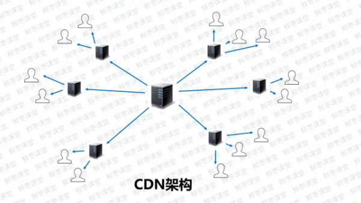

##前后端分离

前后端只通过 JSON 来交流，组件化、工程化不需要依赖后端去实现。 可以通过Vue.js来实现组件化工程化；有哪些好处或弊端？现在的发展趋势是否往这个方面发展


##前端优化技术

具体操作：https://v3u.cn/Index_a_id_86


1. cdn加速

网站上静态资源即css、js全都使用cdn分发，图片亦然。具体来说，CDN就是采用更多的缓存服务器（CDN边缘节点），布放在用户访问相对集中的地区或网络中。当用户访问网站时，利用全局负载技术，将用户的访问指向距离最近的缓存服务器上，由缓存服务器响应用户请求



2.使用Gzip压缩网页


3 减少 HTTP请求数，如果可以的话，尽可能的将外部的脚本、样式进行合并，多个合为一个。另外， CSS、 Javascript、Image 都可以用相应的工具进行压缩，压缩后往往能省下不少空间，如何压缩以及合并外部脚本和样式请参照这篇文章 利用grunt插件来压缩js和css文件用来减少http请求，提高页面效率


4 避免空的src和href
        当link标签的href属性为空、script标签的src属性为空的时候，浏览器渲染的时候会把当前页面的URL作为它们的属性值，从而把页面的内容加载进来作为它们的值。所以要避免犯这样的疏忽。


5 把CSS放到顶部
    网页上的资源加载时从上网下顺序加载的，所以css放在页面的顶部能够优先渲染页面，让用户感觉页面加载很快。

6 把JS放到底部
    加载js时会对后续的资源造成阻塞，必须得等js加载完才去加载后续的文件 ，所以就把js放在页面底部最后加载。
    
7 可缓存的AJAX
异步请求同样的造成用户等待，所以使用ajax请求时，要主动告诉浏览器如果该请求有缓存就去请求缓存内容。如下代码片段, cache:true就是显式的要求如果当前请求有缓存的话，直接使用缓存


8 减少作用域链查找，这一点在循环中是尤其需要注意的问题。如果在循环中需要访问非本作用域下的变量时请在遍历之前用局部变量缓存该变量，并在遍历结束后再重写那个变量，这一点对全局变量尤其重要，因为全局变量处于作用域链的最顶端，访问时的查找次数是最多的。

9 生成纯静态页，也就是把动态内容事先生成好，这样在前端就避免请求后端数据，加快了页面访问速度


###使用场景 利弊切记一定要举例子,如下：

前后端要不要分，怎么分，是由具体业务决定的。

需要搜索引擎带流量的，必须由服务器端渲染。

需要用户登录且不能由搜索引擎抓取，前后端分离是鼓励的。

需要App和后端交互，必须分离。

但是分了就表示架构合理？不一定。设计一套合理／可升级／客户端友好的API也不容易。

要想做好前后端分离，前端开发要了解后端架构，后端开发要虚心学习前端技术，双方如果互相鄙视，分了也白搭


##为什么选择Vue.js

MVVM 是Model-View-ViewModel 的缩写，它是一种基于前端开发的架构模式，其核心是提供对View 和 ViewModel 的双向数据绑定，这使得ViewModel 的状态改变可以自动传递给 View，即所谓的数据双向绑定。
Vue.js 是一个提供了 MVVM 风格的双向数据绑定的 Javascript 库，专注于View 层。它的核心是 MVVM 中的 VM，也就是 ViewModel。 ViewModel负责连接 View 和 Model，保证视图和数据的一致性，这种轻量级的架构让前端开发更加高效、便捷。 

###强调前端为什么要用vue.js 为什么要用工程化

相对 HTML4 , HTML5 最大的亮点是它为移动设备提供了一些非常有用的功能，使得 HTML5 具备了开发App的能力, HTML5开发App 最大的好处就是跨平台、快速迭代和上线，节省人力成本和提高效率，因此很多企业开始对传统的App进行改造，逐渐用H5代替Native，到2015年的时候，市面上大多数App 或多或少嵌入都了H5 的页面。


###Vue.js 和 jquery的区别  强调没有最好的，只有最适合的

jQuery是使用选择器（$）选取DOM对象，对其进行赋值、取值、事件绑定等操作，其实和原生的HTML的区别只在于可以更方便的选取和操作DOM对象，而数据和界面是在一起的。比如需要获取label标签的内容：$("lable").val();,它还是依赖DOM元素的值。 
Vue则是通过Vue对象将数据和View完全分离开来了。对数据进行操作不再需要引用相应的DOM对象，可以说数据和View是分离的，他们通过Vue对象这个vm实现相互的绑定。这就是传说中的MVVM。

##混合式开发

近几年，混合模式移动应用的概念甚嚣尘上，受到了一些中小型企业的青睐，究其原因，混合模式开发可以比传统移动开发节约大量的开发成本和人力成本。

Hybrid App（混合模式移动应用）是指介于web-app、native-app这两者之间的app，兼具“Native App良好用户交互体验的优势”和“Web App跨平台开发的优势”。

说白了，如果走传统移动开发路线，公司业务覆盖多端，那么每个平台势必要请一个专属开发人员，安卓要请一个前端开发，ios同理，那么人力成本则进行了翻倍，同时，如果多端使用不同的代码，当有功能上的修改或者维护时，成本也是不可想象的。试想如果开发者编写一套代码，可编译到iOS、Android、H5、小程序等多个平台，这绝对是省时省力的良好方案。

具体操作：https://v3u.cn/a_id_82


##mvvm 和 mvc 区别？

mvc 和 mvvm 其实区别并不大。都是一种设计思想。主要就是 mvc 中 Controller 演变成 mvvm 中的 viewModel。mvvm 主要解决了 mvc 中大量的 DOM 操作使页面渲染性能降低，加载速度变慢，影响用户体验。和当 Model 频繁发生变化，开发者需要主动更新到 View 。

##vue 的优点是什么？

低耦合。视图（View）可以独立于 Model 变化和修改，一个 ViewModel 可以绑定到不同的"View"上，当 View 变化的时候 Model 可以不变，当 Model 变化的时候 View 也可以不变。
可重用性。你可以把一些视图逻辑放在一个 ViewModel 里面，让很多 view 重用这段视图逻辑。
独立开发。开发人员可以专注于业务逻辑和数据的开发（ViewModel），设计人员可以专注于页面设计，使用 Expression Blend 可以很容易设计界面并生成 xml 代码。
可测试。界面素来是比较难于测试的，而现在测试可以针对 ViewModel 来写。


##vue生命周期的理解？

总共分为 8 个阶段创建前/后，载入前/后，更新前/后，销毁前/后。

创建前/后： 在 beforeCreate 阶段，vue 实例的挂载元素 el 还没有。
载入前/后：在 beforeMount 阶段，vue 实例的$el 和 data 都初始化了，但还是挂载之前为虚拟的 dom 节点，data.message 还未替换。在 mounted 阶段，vue 实例挂载完成，data.message 成功渲染。
更新前/后：当 data 变化时，会触发 beforeUpdate 和 updated 方法。
销毁前/后：在执行 destroy 方法后，对 data 的改变不会再触发周期函数，说明此时 vue 实例已经解除了事件监听以及和 dom 的绑定，但是 dom 结构依然存在

##组件之间的传值？

```
//父组件通过标签上面定义传值
<template>
    <Main :obj="data"></Main>
</template>
<script>
    //引入子组件
    import Main form "./main"

    exprot default{
        name:"parent",
        data(){
            return {
                data:"我要向子组件传递数据"
            }
        },
        //初始化组件
        components:{
            Main
        }
    }
</script>


//子组件通过props方法接受数据
<template>
    <div>{{data}}</div>
</template>
<script>
    exprot default{
        name:"son",
        //接受父组件传值
        props:["obj"]
    }
</script>
```

##路由之间跳转？

声明式（标签跳转）router-link
编程式（ js 跳转） router.push('index')

##懒加载（按需加载路由）（常考）

webpack 中提供了 require.ensure()来实现按需加载。以前引入路由是通过 import 这样的方式引入，改为 const 定义的方式进行引入。

不进行页面按需加载引入方式：
import  home   from '../../common/home.vue'

进行页面按需加载的引入方式：
const  home = r => require.ensure( [], () => r (require('../../common/home.vue')))

##vuex 是什么？怎么使用？哪种功能场景使用它？
vue 框架中状态管理。在 main.js 引入 store，注入。新建了一个目录 store，….. export 。场景有：单页应用中，组件之间的状态。音乐播放、登录状态、加入购物车

```
// 新建 store.js
import vue from 'vue'
import vuex form 'vuex'
vue.use(vuex)
export default new vuex.store({
    //...code
})

//main.js
import store from './store'
...
```

##vue 的双向绑定的原理是什么(常考)

vue.js 是采用数据劫持结合发布者-订阅者模式的方式，通过 Object.defineProperty()来劫持各个属性的 setter，getter，在数据变动时发布消息给订阅者，触发相应的监听回调。

具体步骤：
第一步：需要 observe 的数据对象进行递归遍历，包括子属性对象的属性，都加上 setter 和 getter 这样的话，给这个对象的某个值赋值，就会触发 setter，那么就能监听到了数据变化

第二步：compile 解析模板指令，将模板中的变量替换成数据，然后初始化渲染页面视图，并将每个指令对应的节点绑定更新函数，添加监听数据的订阅者，一旦数据有变动，收到通知，更新视图

第三步：Watcher 订阅者是 Observer 和 Compile 之间通信的桥梁，主要做的事情是:

在自身实例化时往属性订阅器(dep)里面添加自己
自身必须有一个 update()方法
待属性变动 dep.notice()通知时，能调用自身的 update() 方法，并触发 Compile 中绑定的回调，则功成身退。
第四步：MVVM 作为数据绑定的入口，整合 Observer、Compile 和 Watcher 三者，通过 Observer 来监听自己的 model 数据变化，通过 Compile 来解析编译模板指令，最终利用 Watcher 搭起 Observer 和 Compile 之间的通信桥梁，达到数据变化 -> 视图更新；视图交互变化(input) -> 数据 model 变更的双向绑定效果。


