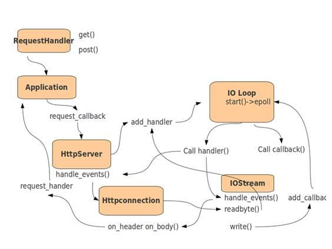

#如何自我介绍（语气要抑扬顿挫，神态要声情并茂，不能机械的没有感情的背）

一般人的自我介绍过于平常，只说姓名、年龄、爱好、工作经验，这些在简历上都有，其实，企业最希望知道的是求职者能否胜任工作，包括：最强的技能、最深入研究的知识领域、个性中最积极的部分、做过的最成功的事，主要的成就等

**您好（下午好/上午好），我是19年毕业的，在RD(Research and Development engineer即研发工程师岗位)岗差不多有三年左右的工作经验，一开始在一家创业型公司起步，当时主力开发语言是python，，使用mtv架构，在公司主要和业务打交道，开发和维护后台的API，大概沉淀了两年左右吧，我跳槽到了（你主要包装的第二家公司），薪酬实现了double，在新的技术团队里，我接触到了前后端分离项目，也学习了异步编程思想，主力框架是tornado，前端技术也有所涉猎，比如vue框架，了解了数据双向绑定理念，同时也学习了在业务解耦和服务封装层面比较流行的docker容器技术，这项技术使我平时开发和测试工作都提高了效率，最近一年左右吧，我经常使用的web框架是tornado,这个框架我个人非常喜欢，它的异步非阻塞特性让我对异步编程思想的认识更深入了。然后由于疫情的因素吧，我也尝试过remote这种工作形式，也锻炼了我在团队中的沟通能力，其实三四年下来，做过的东西解决过的问题也挺多的，待过大团队也经历过小团队，给我的感觉就是互联网企业随着发展，技术和行业边界其实是越来越模糊的，也就是说技术都是具有相通性的，我个人来讲，优势就是技术涉猎比较广，前后端都接触过，踩得坑也比较多，在特定领域有一定的深入，比如异步编程这块。另外我觉得搞开发的，学习能力，总结能力很重要，所以我一直保持着写技术博客的习惯，这样经过沉淀，可以提高一个人的分析能力，也就是解决问题的能力，我的介绍完了，谢谢。**


#少儿编程
您好，我是15年毕业的，毕业之后本来准备考研，后来机缘巧合来到北京实习了一年左右，之后就留在了北京在一家创业型团队（小公司）起步，一直使用python作为开发语言，在公司里也是一直和业务打交道，沉淀了大约一年左右，我跳槽到了（你主要包装的第二家大厂），薪酬实现了double，在新的技术团队里，我接触到了vue框架，体会到了数据双向绑定这种先进的理念，同时由于前后端都参与开发（微信小程序），技术栈也越来越丰富，最近半年我在公司一直负责组织团队技术分享和新员工技术培训以及一些新技术的预研，因为我们公司在东南亚也有分公司，其中一个base在吉隆坡，所以我经常从北京直飞吉隆坡组织技术分享会，在分享会里我接触到了MIT（美国麻省理工）开发的一款面向青少年编程软件SCRATCH，我对这个软件非常感兴趣，同时也觉得很有意思，由于少儿编程在我国处于刚刚起步的阶段，我感觉很多人对少儿编程有很多误解，其实呢，让小朋友学编程并不是就是说以后要去做程序员，而是培养一种冷静和逻辑化的思维，我个人认为思维模式和思考问题的方法是尤为重要的，因为很多adults(成年人)基础教育和家庭教育等等原因导致容易形成很多思维定式，这在工作和学习中会对他们造成障碍，所以在青少年时期就培养逻辑化思维有助于人们成年后有更好的发展。我个人来讲，优势就是技术涉猎比较广，前后端都接触过，另外沟通能力和理解能力比较强，在跨国企业的经历也让我乐于分享，并且我一直保持着写技术博客的习惯，这样也可以结交更多的国际友人，我的介绍完了，thanks。


#三大卖点（如何推销）

**微服务**：什么是微服务，什么是rpc，thrift框架的优势和缺点，与传统http接口的差异，能带来什么收益，二级制协议的原理，如何解耦，为什么使用thrift

thrift怎么用，.thrift文件的好处，thrift的8种数据类型，3种容器

https://v3u.cn/a_id_104

**docker**:什么是linux容器技术，简化配置，应用隔离，快速部署，服务合并，快速部署，底层原理，隔离性怎样做到？命名空间(namespace),cgroups,docker常用命令

举例子：Docker 提供轻量的虚拟化，你能够从Docker获得一个额外抽象层，你能够在单台机器上运行多个Docker微容器，而每个微容器里都有一个微服务或独立应用，例如你可以将Tornado运行在一个Docker，而MySQL运行在另外一个Docker，两者可以运行在同一个服务器，或多个服务器上。未来可能每个应用都要Docker化，引申出低耦合高内聚的概念

实际业务：docker结合fastdfs docker结合redisearch docker结合redis-sentinel docker-componse来部署编排容器集群，使用dockerfile来搭建自己的镜像环境

个人线下调试：以往别人的代码需要git clone然后搭建环境，现在直接下载docker镜像利用容器调试即可，通过-v命令可以挂在代码并且实时调试

**tornado**异步非阻塞:什么是异步非阻塞，什么是同步阻塞，select poll epoll网络模型，举例子：育婴室。强调tornado单线程，由此引出，线程 进程 协程，tornado的异步写法，引出开发人员综合素质问题，引出原生协程：async和await，怎么使用关键字来实现真正的异步非阻塞特性，再由协程的io多路复用和状态保持与切换引出迭代器和生成器，点出生成器是python协程的底层实现，再由生成器引出性能问题，生成器对象和list对象的区别（range），由线程可以引申出线程安全问题，io密集型任务，由tornado+supervisor配合cpu核心起进程来引出cpu密集型任务。

Tornado的异步原理： 单线程的torndo打开一个IO事件循环， 当碰到IO请求（新链接进来 或者 调用api获取数据），由于这些IO请求都是非阻塞的IO，都会把这些非阻塞的IO socket 扔到一个socket管理器，所以，这里单线程的CPU只要发起一个网络IO请求，就不用挂起线程等待IO结果，这个单线程的事件继续循环，接受其他请求或者IO操作，如此循环。



##IOLoop模块

IOLoop是Tornado的核心，负责服务器的异步非阻塞机制。IOLoop是一个基于level-triggered的I/O事件循环，它使用I/O多路复用模型(select,poll,epoll)监视每个I/O的事件，当指定的事件发生时调用对用的handler处理。

##IOStream模块

IOStream模块封装了file-like(file or socket)的一系列非阻塞读写操作。IOStream对file-like的非阻塞读写进行了缓存，提供了读&写Buffer。当读写操作结束时通过callback通知上层调用者从缓存中读写数据。

##HttpServer模块

服务器模块

##Application模块

实现 URI 转发，将 Application 的实例传递给 httpserver ，当监听到请求时，把服务器传回来的请求进行转发，通过调用 __call__ ，处理请求。

##RequestHandeler模块

实现控制器业务的模块

#autoreload模块

实时监测代码修改，也就是debug模式的开关


#内存管理（重点）

为了探索对象在内存的存储，我们可以求助于Python的内置函数id()。它用于返回对象的身份(identity)。其实，这里所谓的身份，就是该对象的内存地址

在Python中，整数和短小的字符，Python都会缓存这些对象，以便重复使用。当我们创建多个等于1的引用时，实际上是让所有这些引用指向同一个对象

```
a = 1
b = 1

print(id(a))
```

为了检验两个引用指向同一个对象，我们可以用is关键字。is用于判断两个引用所指的对象是否相同。由此引出 is 和 == 的区别

同时，由内存地址和链接指向引出  fastdfs的去重功能和文件指纹概念，还能引出linux中的软链接体系

还能扩展出设计模式中的单例模式

同时需要记忆的是，获取一个元素的内存占用量：sys.getsizeof()  单位是字节

##引用计数

在Python中，每个对象都有存有指向该对象的引用总数，即引用计数(reference count)。

我们可以使用sys包中的getrefcount()，来查看某个对象的引用计数。需要注意的是，当使用某个引用作为参数，传递给getrefcount()时，参数实际上创建了一个临时的引用。因此，getrefcount()所得到的结果，会比期望的多1。

某个对象的引用计数可能减少。比如，可以使用del关键字删除某个引用

```
from sys import getrefcount

a = [1, 2, 3]
b = a
print(getrefcount(b))

del a
print(getrefcount(b))
```

##循环引用

两个对象可能相互引用，从而构成所谓的引用环（循环引用）

```
a = []
b = [a]
a.append(b)
```

##垃圾回收

从基本原理上，当Python的某个对象的引用计数降为0时，说明没有任何引用指向该对象，该对象就成为要被回收的垃圾了。比如某个新建对象，它被分配给某个引用，对象的引用计数变为1。如果引用被删除，对象的引用计数为0，那么该对象就可以被垃圾回收

然而，减肥是个昂贵而费力的事情。垃圾回收时，Python不能进行其它的任务。频繁的垃圾回收将大大降低Python的工作效率。如果内存中的对象不多，就没有必要总启动垃圾回收。所以，Python只会在特定条件下，自动启动垃圾回收。当Python运行时，会记录其中分配对象(object allocation)和取消分配对象(object deallocation)的次数。当两者的差值高于某个阈值时，垃圾回收才会启动

##分代回收

Python同时采用了分代(generation)回收的策略。这一策略的基本假设是，存活时间越久的对象，越不可能在后面的程序中变成垃圾。我们的程序往往会产生大量的对象，许多对象很快产生和消失，但也有一些对象长期被使用。出于信任和效率，对于这样一些“长寿”对象，我们相信它们的用处，所以减少在垃圾回收中扫描它们的频率。

Python将所有的对象分为0，1，2三代。所有的新建对象都是0代对象。当某一代对象经历过垃圾回收，依然存活，那么它就被归入下一代对象。垃圾回收启动时，一定会扫描所有的0代对象。如果0代经过一定次数垃圾回收，那么就启动对0代和1代的扫描清理。当1代也经历了一定次数的垃圾回收后，那么会启动对0，1，2，即对所有对象进行扫描。

#数据类型和基本数据结构（重点）

list tuple dict set 区别，常用方法，使用场景，底层实现

扩展点：有序无序，可变不可变（由此引出深拷贝浅拷贝，python传参机制，由传参又引申出不定长参数，不定长参数又可以反着引出tuple和dict，也就是实际应用场景），同构异构，列表推导式，字典推导式，集合推导式，生成器推导式

数据结构：数组 栈（子弹夹，后进先出） 队列（先进先出，由此扩展任务队列，消息队列，rabbitmq和redis，以及进程间通信） 树（层级结构，btree,b+tree，引申出索引，递归算法） 链表（单双向，闭环） 散列表（引申出dict，hash,hash一致性算法）


#python基础（重点）

解释器，其他的解释器，全局解释器锁（存在原因，如果避免，如何更换解释器），python自省，切片，负索引，装饰器，手写装饰器，手写单例模式（好处和坏处，使用背景，又单例模式引申出数据库连接池），手写工厂模式，上下文管理，lambda表达式(优点和缺点)，命名空间，三元运算，magic方法(init和new的区别)，继承，类方法静态方法，magic方法，四大高阶函数（引申python2和3区别），<font color=red>线程 进程 协程（引申出原生协程async await和greenlet以及gevent的区别，引申出大文件操作https://v3u.cn/a_id_97） 迭代器和生成器（yield和return区别，yield和send的区别）</font> 

#算法

递归（引申出实际业务：无限分类,celery遇到的关键字问题，使用递归脚本进行修改），八大查找，八大排序，完全手写，时间复杂度，空间复杂度

#数据库（重中之重）

**mysql**:sql优化，事务，并发事务带来的脏读，幻读，事务隔离级别（四个），主从热备读写分离(https://v3u.cn/a_id_85)

binlog日志相关，主从同步延迟问题（架构层面和硬件层面），悲观锁和乐观锁，引擎（myisam和innnodb），表锁和行锁，索引（优缺点和使用场景），索引存储结构(b+tree和btree (https://v3u.cn/a_id_91)

联合索引，最左前缀原则，梯度漏斗，执行计划(explain),慢查询日志（showprocesslist），分表（水平和垂直），44道场景题（必须闭着眼睛也能写出来），备份

**redis**:特点，背景，memcached和redis区别，为什么快（引申io多路复用，避免上下文切换，引申和协程的相同点），数据类型：string，list（引申队列，消息中间件），set（去重功能引申商品标签，在线人数统计），sorted set（有序集合引申出排行榜），hash 分别深入研究，各个数据类型的实现原理，使用背景，持久化方案（三种，怎么用，在什么场景下用什么方案），缓存集群（哨兵模式，同步，选举），并发竞争问题和分布式锁（setnx），incr(自动计数)，与mysql数据同步问题怎么解决（终极方案由mysql的binlog日志入手，撰写同步脚本），redisearch全文检索（为什么用，背景，怎么用）

**mongodb**:底层，实现原理，背景，bson和json,聚合，备份，和mysql的区别，基本语法，分组查询，异步读写（Motor和pymongo的区别，配合tornado如何实现异步操作），命名空间

#网络编程（重点）

网络七层协议，tcp协议（三次握手四次挥手）,udp协议，http和websocket(websocket心跳以及重连问题),http和https,ipv4和ipv6,4g和5g,32位和64位，跨域问题（浏览器同源策略问题，如何解决），http所有状态码,get和post区别，delete和put以及options的区别

#celery和rabbitmq/redis(重点)

工作原理，使用背景(永远不要说发短信和邮件，直接说用celery任务队列执行爬虫任务)，生产者消费者模型，消息中间件，rabbbitmq和redis区别，Broker，Worker,Backend ，重复消费问题，消息丢失问题，消息稳定性问题

#jwt和token

背景，为什么用，怎么用，token(三部分，各有什么用)，引申前后端分离，引申单点登录(sso)，csrf跨域攻击，自验证流程，签名，session和cookie和webstorage区别和用法：https://v3u.cn/a_id_94

#高负载和高可用

qps,pv,uv,留存用户，活跃用户，流量，带宽，负载均衡结构图，nginx负载均衡策略，几台机器，数据层，服务层，缓存层

话术：https://v3u.cn/a_id_95

具体操作：https://v3u.cn/a_id_87

#Supervisor和Fastdfs

守护进程，如何配置，supervisor+tornado,文件指纹，分布式文件存储方案（引申阿里云oss），文件hash（hash一致性算法）

https://v3u.cn/a_id_102

https://v3u.cn/Index_a_id_76


#行业背景

5g 新能源 短视频 p2p 在线教育 少儿编程 区块链 微服务 低耦合高内聚 车联网

#你在大厂也是前后端都做，而且还会部署？

我在公司主要负载后端的微服务架构(thrift)和web接口(tornado)，但是同时我对前端也很感兴趣，自己喜欢私下研究新技术，也经常和公司的前端有沟通和联调，我本人自己也有开源的vue项目和基于mpvue的小程序也上线过，没有人逼我，完全是我对自己的严格要求，我始终认为只有拥抱新技术才能进步，并且架构师的职业规划也促使我关注前端用来反哺后端，同时我自己的个人网站也是自己开发的，用于练手的同时也会实验新技术，所以前端也是我的强项之一，没有任何问题。

#你对加班的看法？

回答提示：实际上好多公司问这个问题，并不证明一定要加班。 只是想测试你是否愿意为公司奉献。

回答样本：如果是工作需要我会义不容辞加班。我现在单身，没有任何家庭负担，可以全身心的投入工作。但同时，我也会提高工作效率，减少不必要的加班，也就是不会为了加班而加班

#你对薪资的要求？

回答提示：如果你对薪酬的要求太低，那显然贬低自己的能力；如果你对薪酬的要求太高，那又会显得你分量过重，公司受用不起。一些雇主通常都事先对求聘的职位定下开支预算，因而他们第一次提出的价钱往往是他们所能给予的最高价钱。他们问你只不过想证实一下这笔钱是否足以引起你对该工作的兴趣。

回答样本一：“我对工资没有硬性要求。我相信贵公司在处理我的问题上会友善合理。我注重的是找对工作机会，所以只要条件公平，我则不会计较太多

回答样本二：我受过系统的软件编程的训练，不需要进行大量的培训。而且我本人也对编程特别感兴趣。因此，我希望公司能根据我的情况和市场标准的水平，给我合理的薪水。

回答样本三：如果你必须自己说出具体数目，请不要说一个宽泛的范围，那样你将只能得到最低限度的数字。最好给出一个具体的数字，这样表明你已经对当今的人才市场作了调查，知道像自己这样学历的雇员有什么样的价值。

#你的职业规划?

最普通的回答应该是“我准备在技术领域有所作为”或“我希望能按照公司的管理思路发展”,不过也可以参照首页的30年规划

#你能为公司带来什么？

我目前可以帮助公司在业务层解耦，在技术层优化，可以提供多个解决方案的同时，寻找最优方案

最拿手的技术目前是脚本语言python，也就是后端技术一直在深研，同时我也关注前端技术，反哺后端

独立支撑过公司的主力项目，从需求调研和分析，到项目原型图的构建，功能设计，具体接口实现，有高负载高并发系统的架构经验，对系统性能优化有自己的见解和解决方案

#你还有什么问题要问吗？

企业不喜欢说“没有问题”的人，因为其很注重员工的个性和创新能力。企业不喜欢求职者问个人福利之类的问题

贵公司对新入公司的员工有没有什么培训项目，我可以参加吗？贵公司的晋升机制是什么样的？贵公司有定期的技术分享吗？

#谈谈你对跳槽的看法？

正常的"跳槽"能促进人才合理流动，应该支持；

频繁的跳槽对单位和个人双方都不利，应该反对。

#你对于我们公司了解多少？

在去公司面试前上网查一下该公司主营业务，近期新闻，或者职位描述深入挖掘一下


#你之前的待遇是？

根据面试效果随时调整(15k)，13薪（年底一个月的年终奖），全勤奖，项目奖金，大厂有限制出售的股票（通常国外上市是美股，国内上市是a股，你就说给了100股，但是限制出售，需要待够5年才能全部售出）