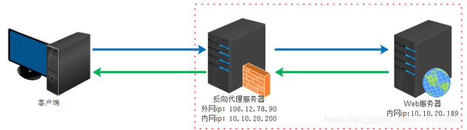
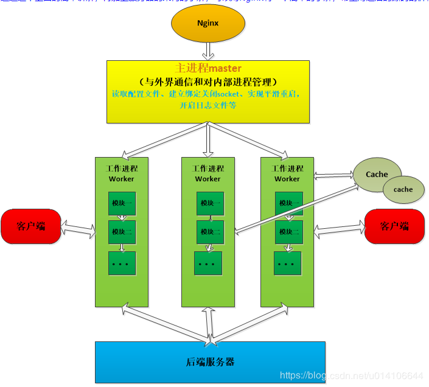
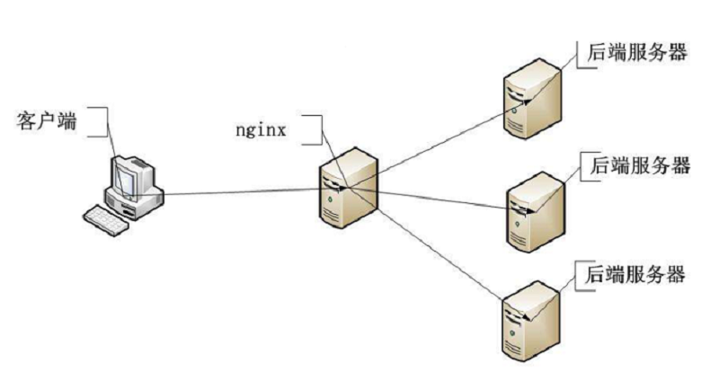
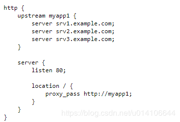
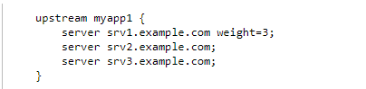
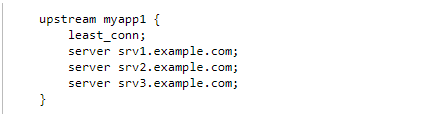
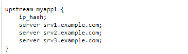

## Nginx负载均衡

正向代理，是在用户端的。比如需要访问某些国外网站，我们可能需要购买vpn。
并且vpn是在我们的用户浏览器端设置的(并不是在远端的服务器设置)。

反向代理是作用在服务器端的，是一个虚拟ip(VIP)。对于用户的一个请求，会转发到多个后端处理器中的一台来处理该具体请求。


Nginx一般作为反向代理服务器来实现反向代理来转发处理请求，同时也可以作为静态资源服务器来加快静态资源的获取和处理。

反向代理是指以代理服务器来接受internet上的连接请求，然后将请求转发给内部网络上的服务器，并将从服务器上得到的结果返回给internet上请求连接的客户端，此时代理服务器对外就表现为一个服务器。客户端是无感知代理的存在的，反向代理对外都是透明的，访问者者并不知道自己访问的是一个代理。因为客户端不需要任何配置就可以访问。

作用：保证内网的安全，可以使用反向代理提供WAF功能，阻止web攻击；负载均衡，通过反向代理服务器来优化网站的负载

具体搭建：https://v3u.cn/a_id_77




## Nginx架构



Nginx采用多进程方式，一个Master与多个Worker进程。客户端访问请求通过负载均衡配置来转发到不同的后端服务器依次来实现负载均衡。

##Nginx负载均衡策略

Nginx负载均衡策略主要有 轮询，加权轮询，最少连接数以及IP Hash。



轮询策略： 实现请求的按顺序转发，即从服务srv1--srv2--srv3依次来处理请求



加权轮询策略： 请求将按照服务器的设置权重来实现请求转发和处理，如下所示，最终请求处理数将为3：1：1，一般情况下加权的依据是根据服务器配置来决定的，即配置好的机器分配的权重高


最少连接数策略：  请求将转发到连接数较少的服务器上


Ip Hash策略：  web服务需要共享session,使用该策略可以实现某一客户端的请求固定转发至某一服务器


ip_hash算法的原理很简单，根据请求所属的客户端IP计算得到一个数值，然后把请求发往该数值对应的后端。

所以同一个客户端的请求，都会发往同一台后端，除非该后端不可用了。ip_hash能够达到保持会话的效果。

ip_hash是基于round robin的，判断后端是否可用的方法是一样的。

```
for (i = 0; i < 3; i++) {  
    hash = (hash * 113 + iphp->addr[i]) % 6271; //iphp->addr[i]为ip的点分十进制法的第i段
}
```

hash3就是计算所得的数值，它只和初始数值hash0以及客户端的IP有关。

for循环 i取 012三个值，而ip的点分十进制表示方法将ip分成四段（如：192.168.1.1），但是这里循环时只是将ip的前三个端作为参数加入hash函数。这样做的目的是保证ip地址前三位相同的用户经过hash计算将分配到相同的后端server。

作者的这个考虑是极为可取的，因此ip地址前三位相同通常意味着来着同一个局域网或者相邻区域，使用相同的后端服务让nginx在一定程度上更具有一致性。

第二步，根据计算所得数值，找到对应的后端。

```
w = hash3 % total_weight;

while (w >= peer->weight) {

    w -= peer->weight;

    peer = peer->next;

    p++;

}
```

total_weight为所有后端权重之和。遍历后端链表时，依次减去每个后端的权重，直到w小于某个后端的权重。

选定的后端在链表中的序号为p。因为total_weight和每个后端的weight都是固定的，所以如果hash3值相同，

则找到的后端相同。

## Supervisor

Supervisor    

是用Python开发的一个client/server服务，是Linux/Unix系统下的一个进程管理工具，不支持Windows系统。它可以很方便的监听、启动、停止、重启一个或多个进程。用Supervisor管理的进程，当一个进程意外被杀死，supervisort监听到进程死后，会自动将它重新拉起，很方便的做到进程自动恢复的功能，不再需要自己写shell脚本来控制。

说白了，它真正有用的功能是俩个将非daemon(守护进程)程序变成deamon方式运行对程序进行监控，当程序退出时，可以自动拉起程序。

但是它无法控制本身就是daemon的服务。

具体安装和配置流程参照 https://v3u.cn/Index_a_id_76