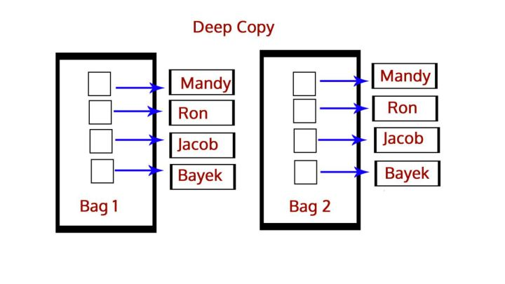
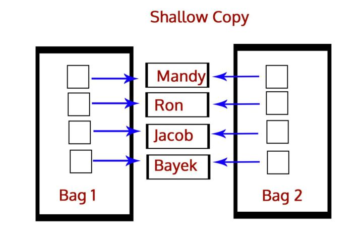

#深拷贝和浅拷贝之间的区别是什么？

对象的赋值就是简单的引用,a = [1,2,3], b=a, 在上述情况下,a和b是一样的,他们指向同一片内存,b不过是a的别名,是引用,我们可以使用b is a 去判断,返回True,表名他们地址相同内容也相同,也可以使用id()函数来查看.看两个列表地址是否相同.


深拷贝就是将一个对象拷贝到另一个对象中，这意味着如果你对一个对象的拷贝做出改变时，不会影响原对象。在Python中，我们使用函数deepcopy()执行深拷贝

```
import copy
b=copy.deepcopy(a)
```



而浅拷贝则是将一个对象的引用拷贝到另一个对象上，所以如果我们在拷贝中改动，会影响到原对象。我们使用函数function()执行浅拷贝

```
b=copy.copy(a)
```



切片操作是浅拷贝

工厂函数是浅拷贝：lst1 = list(lst)

copy函数：lst1 = copy.copy(lst)

##注意一点，浅拷贝要分三种情况进行讨论

1.拷贝不可变对象：只是增加一个指向原对象的引用，改变会互相影响。

```
>>> a = (1, 2, [3, 4])
>>> b = copy.copy(a)
>>> b
... (1, 2, [3, 4])
# 改变一方，另一方也改变
>>> b[2].append(5)
>>> a
... (1, 2, [3, 4, 5])

```

2.拷贝可变对象(一层结构)：产生新的对象，开辟新的内存空间，改变互不影响。

```
>>> import copy

>>> a = [1, 2, 3]
>>> b = copy.copy(a)
>>> b
... [1, 2, 3]
# 查看两者的内存地址，不同，开辟了新的内存空间
>>> id(b)
... 1833997595272
>>> id(a)
... 1833997595080
>>> a is b
... False
# 改变了一方，另一方关我卵事
a = [1, 2, 3]    b = [1, 2, 3]
>>> b.append(4)
>>> a
... [1, 2, 3]
>>> a.append(5)
>>> b
... [1, 2, 3, 4]
```

3.拷贝可变对象(多层结构)：产生新的对象，开辟新的内存空间，不改变包含的子对象则互不影响、改变包含的子对象则互相影响。

```

>>> import copy

>>> a = [1, 2, [3, 4]]
>>> b = copy.copy(a)
>>> b
... [1, 2, [3, 4]]
# 查看两者的内存地址，不同，开辟了新的内存空间
>>> id(b)
1833997596488
>>> id(a)
1833997596424
>>> a is b
... False
# 1.没有对包含的子对象进行修改，另一方关我卵事
a = [1, 2, [3, 4]]    b = [1, 2, [3, 4]]
>>> b.append(5)
>>> a
... [1, 2, [3, 4]]
>>> a.append(6)
>>> b
... [1, 2, [3, 4], 5]
# 2.对包含的子对象进行修改，另一方也随之改变
a = [1, 2, [3, 4]]    b = [1, 2, [3, 4]]
>>> b[2].append(5)
>>> a
... [1, 2, [3, 4, 5]]
>>> a[2].append(6)
>>> b
... [1, 2, [3, 4, 5, 6]]

```