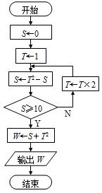

#递归

在调用一个函数的过程中，直接或间接地调用了函数本身这个就叫递归。但为了避免出现死循环，必须要有一个结束条件

在函数中调用函数本身时，相当于你让程序回到函数的第一行重新走一遍而已。



```
def foo(S, T):
    S = T * T - S
    if S >= 10:
        W = S + T * T
        return W
    else:
        foo(S, T * 2)
```

## 回文判断

```
def isPalindrome(s):
    if len(s) <= 1:
        return True
    else:
        return s[0] == s[-1] and isPalindrome(s[1:-1])
```

判断第一位和最后一位是否相当，随后递归进行切片进行比对，如果最终长度小于1，便是回文