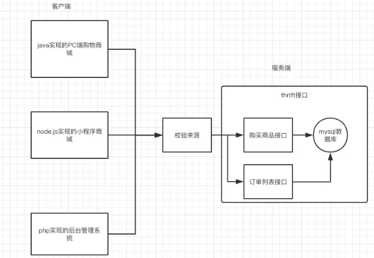

#微服务和RPC框架

什么是微服务

具体操作:https://v3u.cn/a_id_104

一般情况下，业务应用我们都会采用模块化的分层式架构，所有的业务逻辑代码最终会在一个代码库中并统一部署，我们称这种应用架构为单体应用。 单体应用的问题是，全部开发人员会共享一个代码库，不同模块的边界模糊，实现高内聚、松耦合极其困难。 肯定大家会碰到过这类场景，当尝试去重构改进代码时，改了一个地方好几个其他模块也需要同步改动， 当初划分的模块边界轻易被穿透，有人给这种应用的架构起了一个很形象的名字叫 “洋葱架构”。

特点：

1、服务注册、服务发现、健康检查

   如果我们采用进程内LB方案，那么服务自注册一般统一做在服务器端框架中，健康检查逻辑由具体业务服务定制，框架层提供调用健康检查逻辑的机制，服务发现和负载均衡则集成在服务客户端框架中。

2、RPC/REST和序列化

  框架层要支持将业务逻辑以HTTP/REST或者RPC方式暴露出来，HTTP/REST是当前主流API暴露方式，在性能要求高的场合则可采用Binary/RPC方式。针对当前多样化的设备类型(浏览器、普通PC、无线设备等)，框架层要支持可定制的序列化机制，例如，对浏览器，框架支持输出Ajax友好的JSON消息格式，而对无线设备上的Native App，框架支持输出性能高的Binary消息格式。

3、管理接口

  框架集成管理接口，一方面可以在线查看框架和服务内部状态，同时还可以动态调整内部状态，对调试、监控和管理能提供快速反馈。Spring Boot微框架的Actuator模块就是一个强大的管理接口。对于框架层和服务的内部异常，如果框架层能够统一处理并记录日志，对服务监控和快速问题定位有很大帮助。

4、安全控制

  安全和访问控制逻辑可以在框架层统一进行封装，可做成插件形式，具体业务服务根据需要加载相关安全插件。

5、配置管理

  除了支持普通配置文件方式的配置，框架层还可集成动态运行时配置，能够在运行时针对不同环境动态调整服务的参数和配置。

6、监控日志

  框架一方面要记录重要的框架层日志、服务调用链数据，还要将日志、调用链数据等接口暴露出来，让业务层能根据需要记录业务日志数据。在运行环境中，所有日志数据一般由日志系统做进一步分析和处理。

7、统一错误处理

  对于框架层和服务的内部异常，如果框架层能够统一处理并记录日志，对服务监控和快速问题定位有很大帮助。

8、流控和容错

  框架集成限流容错组件，能够在运行时自动限流和容错，保护服务，如果进一步和动态配置相结合，还可以实现动态限流和熔断。

#RPC框架

RPC=Remote Produce Call 是一种技术的概念名词. HTTP是一种协议,RPC可以通过HTTP来实现,也可以通过Socket自己实现一套协议来实现.所以楼主可以换一个问法,为何RPC还有除HTTP 之外的实现法,有何必要.毕竟除了HTTP实现外,私有协议不具备通用性.那么我想唯一的答案就在于HTTP不能满足其业务场景的地方,所以这个就要具体 案例具体分析了.

http接口是在接口不多、系统与系统交互较少的情况下，解决信息孤岛初期常使用的一种通信手段；优点就是简单、直接、开发方便。利用现成的http协议 进行传输。但是如果是一个大型的网站，内部子系统较多、接口非常多的情况下，RPC框架的好处就显示出来了，首先就是长链接，不必每次通信都要像http 一样去3次握手什么的，减少了网络开销；其次就是RPC框架一般都有注册中心，有丰富的监控管理；发布、下线接口、动态扩展等，对调用方来说是无感知、统 一化的操作。第三个来说就是安全性。最后就是最近流行的服务化架构、服务化治理，RPC框架是一个强力的支撑

RPC是一个软件结构概念，是构建分布式应用的理论基础。就好比为啥你家可以用到发电厂发出来的电？是因为电是可以传输的。至于用铜线还是用铁丝还是其他 种类的导线，也就是用http还是用其他协议的问题了。这个要看什么场景，对性能要求怎么样。比如在java中的最基本的就是RMI技术，它是java原 生的应用层分布式技术。我们可以肯定的是在传输性能方面，RMI的性能是优于HTTP的。那为啥很少用到这个技术？那是因为用这个有很多局限性，首先它要 保证传输的两端都要要用java实现，且两边需要有相同的对象类型和代理接口，不需要容器，但是加大了编程的难度，在应用内部的各个子系统之间还是会看到 他的身影，比如EJB就是基于rmi技术的。这就与目前的bs架构的软件大相径庭。用http必须要服务端位于http容器里面，这样减少了网络传输方面 的开发，只需要关注业务开发即可。所以在架构一个软件的时候，不能一定根据需求选定技术。

#Thrift

Thrift实际上是实现了C/S模式，通过代码生成工具将接口定义文件生成服务器端和客户端代码（可以为不同语言），从而实现服务端和客户端跨语言的支持。用户在Thirft描述文件中声明自己的服务，这些服务经过编译后会生成相应语言的代码文件，然后用户实现服务（客户端调用服务，服务器端提服务）便可以了。其中protocol（协议层, 定义数据传输格式，可以为二进制或者XML等）和transport（传输层，定义数据传输方式，可以为TCP/IP传输，内存共享或者文件共享等）被用作运行时库。

Thrift最初由facebook开发，07年四月开放源码，08年5月进入apache孵化器。

Apache Thrift 是一款跨语言的服务框架，传输数据采用二进制格式，相对 XML 和 JSON 体积更小，对于高并发、大数据量和多语言的环境更有优势。



数据类型

Thrift 支持 8 种数据类型：

bool: true or false

byte: signed byte

i16/i32/i64: 16/32/64位 signed integer

double: 64位

binary: byte array

string

3 种容器：

list<t1>: 排序数组，可以重复

set<t1>: 集合，每个元素唯一

map<t1, t2>: t1 唯一


#什么是Thrift
Thrift是一种接口描述语言和二进制通讯协议，它被用来定义和创建跨语言的服务，这是维基百科的描述。简单来说就是你可以按照Thrift定义语法编写.thrift,然后用Thrift命令行生成各种语言的代码，比如OC、Java、C++、JS，调用这些代码就可以完成客户端与服务器的通信了，不需要自己去写网络请求、数据解析等接口。更多详情可以通过这里了解。

#为什么使用Thrift

在实际项目中主要考虑到这两个优点：

RPC。通过简单定义Thrift描述语言文件，使用Thrift -gen命令可以生成多种语言的代码，这些代码包含了网络通信,数据编解码的功能。这就免去了前后台编写这部分繁琐的代码，同时也统一了前后台的实现逻辑。

Thrift的二进制数据的编码比json更加紧凑、减少了无用的数据的传输。这也是本文讨论的重点。


#ThriftPy2是Apache Thrift 的纯 python 实现

```
pip3 install thriftpy2
```


