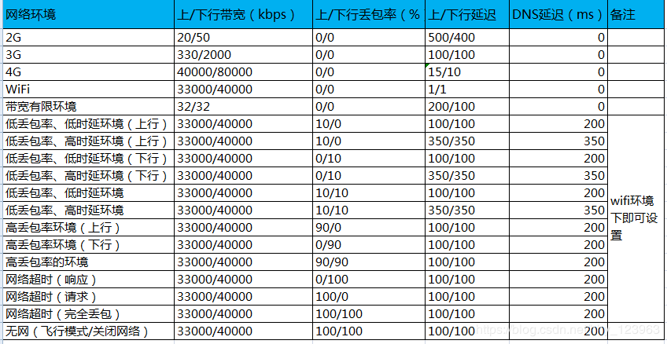

## QA自我介绍
您好，我是18年毕业于某某大学某某专业，参加工作差不多有三年左右了，刚开始的工作相对简单，主要就是功能测试，就像捕鼠器一样，捕捉bug，只要对业务和项目文档足够熟悉，功能测试并不复杂，在这期间，我自学了markdown语法，将传统的excel用例改造成兼容性流通性更广泛的markdown文档形式，提高了生产力，同时，我也接触到了Docker技术，用其构建了API/UI分布式自动化测试系统，测试效率有了显著提升，在移动端app测试领域，我熟练使用Genymotion配合adb命令对app进行高效的兼容性测试，几年下来，我常常在想，QA找bug到底是为了什么？其实不是为了找bug而找bug，而是为了质量(产品质量保证工程师)，所以仅仅把自己定位成测试是不行的，还需要具备产品质量保证的理念，站在用户角度全面提升产品质量，我的介绍完了，谢谢。

## QA团队的目的与原则是什么
通过测试工作可以发现并修复软件当中存在的缺陷；可以降低同产品开发遇到的风险；记录软件运行过程中的一些数据，从而为决策者提供技术支持。
一般遵循2/8定律，核心功能占20%，非核心占80%，我们会集中测试20%的核心功能，发现缺陷的几率会高于80%，因此，遇到的缺陷都会集中20%功能模块里。另外穷举测试不可取，所以需要合理的编写测试用例，做到有条理的进行测试工作。

## 具体测试流程
制定测试计划-》需求评审-》编写测试用例-》提交测试-》冒烟测试-》常规测试-》测试完成，出具测试报告-》测试通过上线-》测试不通过，打回修改，重新测试。

## 四大文档：

### 测试计划(TestPlan)：描述了要进行的测试活动的范围、方法、资源和进度的文档；是对整个信息系统应用软件组装测试和确认测试。它确定测试项、被测特性、测试任务、谁执行任务、各种可能的风险。测试计划可以有效预防计划的风险，保障计划的顺利实施。

### 测试用例(TestCase)：就是为了验证某个需求是否实现、是否存在缺陷，在测试执行之前设计的一套详细的测试方案。测试用例通常由 用例编号,测试标题、前置条件、测试数据、测试步骤、预期结果等组成。等价类划分法/场景法/流程分析法/错误推断法/边界值分析
### 测试报告(TestReport)：具体执行测试用例后的报告文件，可以利用unittest自动生成，分为功能序号 功能名称 功能流程 测试结果

### 缺陷报告(BugReport)：pingcode.com对于测试报告中产生的bug进行汇总和追踪，一般包括所属项目/负责人/开始时间/结束时间/优先级(最高/较高/普通/较低/最低)/严重程度(致命/严重/一般/建议)/类别(功能/性能/接口/安全/ui/兼容性/易用性)/复现概率(大概率/小概率/偶发)/故事/故事点

## 如何提高测试覆盖率

测试用例真正做到100%覆盖是很难的。按设计中的功能划分，每个功能都写到了这个用例就覆盖完整了?这还远远不够。因为我们知道还有大量的内部处理、转换、业务逻辑、相互影响的关系等都是需求或设计中所不会点明的。而这些一方面需要靠测试人员对项目本身的了解，另一方面要靠测试人员的经验，来一一找到这些隐藏点并予以测试，才能真正地保证我们的测试覆盖度。

举例子：比如一个非简单的方法，两个参数a和b一个返回值，逻辑是两个参数相加求和，将和返回，这种简单的需求，如果我要写测试用例用来做单元测试，那就非常简单，从输入和输出两个方面，输入我只要验证参数合法性即可，无非是a合法，b不合法；a不合法，b合法，都合法，以及都不合法四种情况，而输出我只要验证返回值是否正确就可以，这样的例子我们可以做到用例覆盖率百分之百，但是实际工作中几乎不会出现这么简单的需求。

以我负责的登录功能为例，需要多维度多角度的考虑用例：

UI层面：页面排版布局，多系统多浏览器的兼容性测试
功能层面：参数通过性；长度校验边界值，参数类型特殊符号，参数组合，非空验证，提示信息
网络层面：弱网环境下是否影响功能
性能层面：多用户并发登录响应时间，资源占用
安全层面：注入攻击，csrf攻击


## QA职业规划：

正所谓，人无远虑必有近忧，合理的规划可以帮助我们继续前进

测试工程师-》测试开发工程师-》性能测试工程师-》性能调优专家-》测试架构师

## 公司组织架构

成熟的互联网公司你目前所在的团队，有着成熟的业务和稳定的收入模式，同时在稳步扩张中。Android开发，10人+；IOS开发，10人；前端工程师，5人（实在不好招）；服务端开发，40人+（分研发小组，也就是你在的组，有8人左右，团建都是以小组为单位）；数据分析，6人左右；QA，15-20人，部分外包；PM，20人；UI/UE，5人；运营/客服，30人+，部分外包；市场/销售，10人；另有公司公共的OPS（运维）（4人）、CM（配置管理）（2人）、DBA支持（4人）


# 自动化测试

关于自动化测试，我主要参与的有三类，分别是接口自动化测试，主要使用requests库配合unittest，将用例批量导入后执行测试脚本，利用unittest导出测试报告，以及ui自动化测试，使用的是selenium配合unittest，最后是移动端自动化测试，利用genymotion配合adb命令和appuim脚本对app进行自动化安装等一系列操作。

## 怎么去找到难以复现的问题 ？
答案:查找日志，看是那个环节出现了问题 2）、尽量去重复操作出现问题的步骤，从不同角度去尝试

## 测试用例执行后bug占整体的比率。
答案：一般是30-40%左右

## 在项目中发现哪些经典bug？什么原因导致的？
有一个bug很有意思，就是我在参与线量化金融交易平台提测的时候，有一个模块是用户积分功能，每当用户发起一次外汇交易的时候，积分就会递减，这样这次交易的手续费就可以减免，当用户量少的时候，这个逻辑没有问题，测试用例都是通过的，但是当我用apachebench进行高并发测试的时候，用户积分就会变成负数，比如-12，所以真实环境很难复现，经过和RD的联调，发现原因是由于积分递减逻辑没有进行加锁控制，当大量的交易请求打过来的时候，积分表会同时收到大量的递减请求，而递减的同时无法判断积分余额，所以导致bug的出现，这个bug告诉我，测试环境下的逻辑正常并不说明任何事，接口的健壮性还得在高压环境下进行测试。

## B/S架构和C/S架构区别？

B/S架构需要重点考虑系统在不同的浏览器中的兼容性问题(浏览器的内核不同) 其实就是web网站 b代表browser
C/S 架构需要考虑系统在不同平台的安装、卸载、升级 c代表client

## HTTP协议
超文本传输协议，应用层协议，由请求与响应组成。
常见的请求方式有POST/GET
常见的状态码200ok，301永久移动，302临时移动，404找不到资源，500服务器内部错误。

## POST与GET区别
1.get请求常用在获取数据，post常用于发送数据
2.get由于浏览器外部因素会限制url的长度，post则没有
3.get请求的数据是跟随请求地址一起发送，而post是在请求体中单独发送。

## Cookie和Session的区别与联系
cookie是存放在浏览器上而session是存放在服务器上的。
cookie不是很安全，涉及到用户隐私方面尽量存放在session中。
当访问量增多时，session会更加占用服务器资源。

## 单元测试与集成测试的侧重点
单元测试是对程序最小可测试的模块进行测试 集成测试是把各个模块连接起来时，穿越模块接口的数据是否会丢失。

## 系统测试范围和类型
功能测试、用户体验测试、性能测试、UI测试、兼容性测试、安装测试、文档测试、稳定性测试等

## a测试与ß测试的区别
a测试：公司组织的内部人员进行的测试 ß测试：公司组织的典型客户在实际生活中使用。

## 什么是灰度测试
就是在生产环境小范围的一种测试，有点像网络游戏中的内测或者封测

## 验收测试怎么做？
在UAT测试之前，我们会制定测试方案，选择基线用例，即级别高的用例，在UAT测试环境上进行测试，如果测试通过，验收测试就通过了。

## 白盒、黑盒和灰盒测试区别
白盒测试：对程序的内部结构与算法进行的测试 黑盒测试：不考虑程序的内部结果，只检查程序是否实现了需求的功能 灰盒测试：关注系统接口所实现的功能，是否和需求一致。

## 冒烟测试的目的
检查程序的基本功能是否正常，是否可以正常启动服务，属于最基本的提测项目

## 回归测试怎么做？
首先，把bug单对应的用例执行一遍，还要检查有数据交互的模块会不会受影响，有没有引入新的问题；项目上线前，还要把当前版本的重要功能以及冒烟测试的用例都回归一遍，确保重要功能上线后不出问题。

## 全部回归与部分回归的区别？
全量回归：对软件的新版本测试时，重复执行上一个版本测试时使用的测试用例，防止以前没有的问题现在出问题了 部分回归：当开发修复某个bug时，我们需要去检查该bug是否被修复，还需要检查与之相关联的模块是否受到影响。

## 需求分析的目的
澄清需求，提取测试点

## 什么时候开始写测试计划
需求分析之后

## 常见的测试风险
进度风险、质量风险和需求变更

## 测试用例的要素
用例编号,用例名称,级别,预置条件,测试步骤,期望结果

## 如何尽快找到软件中的bug?
尽快熟悉公司的产品业务，只有熟悉了产品的业务流程、你才能迅速找出软件中存在的一些重要的缺陷；
把自己当成用户，把自己当成是用户去使用该系统
善于怀疑，不要过于相信开发人员的能力；

## ATM机吞卡的吞卡现象是不是BUG?
不一定，看是什么情况下吞卡。如：输入三次密码错误吞卡是正常的，不属于BUG；若输入一次密码错误吞卡则是不正常的，属于BUG。

## 你们发现bug会怎么处理。
答:发现bug后，我们会先自己定位一下，比如，抓个包，看看是前端的问题，还是后端的问题，检查下数据库的数据是不是正确的，尽量把问题发生的原因或者产生的日志找出来，方便开发定位问题，然后就提单给开发，然后开发做出相应的处理，开发修复完后就进行回归测试，回归测试通过后就关闭这个bug，没有通过就继续给回开发修复。如果遇到开发认为这个不是bug的话，那么我们就要和开发沟通，然后我们要坚持自己的立场，通过讨论后一致认为是bug就给开发修复，不是就关闭这个bug。如果开发和我们意见一直不一致，那么就要将问题升级，召集开发经理和测试经理一起讨论，再做决定。

# 性能测试/压力测试 话术

一般情况下，性能测试是针对接口来操作的，需要关注下面几个指标

* 需满足的并发数(qps)
* TPS（每秒处理事务的能力）
* 响应时间（平均响应时间、90%响应时间）
* 错误率

假如系统每天活跃用户数有8W左右，平均在线时长10分钟

那么接口需要满足的并发请求数为：500左右，TPS大概在100左右

所以可以直接使用Jmeter或者ApacheBench针对500并发分层对接口进行请求操作。

* 响应时间

根据在并发情况下的响应时间2/5/10原则，最长不能超过10s

* 错误率

具体系统具体要求，一般小于万分之一

* 缓存命中率

具体系统具体要求，一般大于85%通过,可以进入redis数据库，通过命令 keys * 来查看

* CPU占用率

70% 好，85% 坏，90%+ 很差  通过top命令来查看

* 内存使用率

一般小于80%通过 通过free命令来查看


如果需要记录具体的性能测试日志，可以使用下面的命令，通过指定进程号来记录性能测试信息：

使用命令查看CPU、内存变化情况：

```
top -b -d 1 -p 27854 > 0904log
```

查看进程号命令

```
ps ef |grep acs-job 
```

若重启服务器后，pid会发生变化，必须重新获取


## 性能测试----阶段 1
性能测试：以系统设计初期规划的性能指标为预期指标，对系统不断施加压力，验证系统在资源可接受的范围内，是否达到性能预期。

## 负载测试----阶段 2
负载测试：对系统不断的增加并发请求以增加系统压力，直到系统的某项或者多项性能指标达到安全临界值，

如某种资源已经饱和状态，这时候继续对系统施加压力，系统的处理能力不但不能提高，反而会下降。

## 压力测试--阶段 3

压力测试：超过安全负载的情况下，对系统继续施加压力，直到系统崩溃不能再处理任何请求，以此获得系统最大压力承受能力。

## 稳定性测试

稳定性测试：被测试系统再特定硬件，软件，网络环境条件下，给系统加载一定业务压力，是系统运行一段较长时间，以此检测系统是否稳定。一般情况下，可以编写测试脚本配合crontab定时任务进行稳定性测试,测试周期大概在3天左右

## 你们系统哪些地方(哪些功能)做了性能测试？
我们选用了用户使用最频繁的功能来做性能测试，比如：登陆，打开系统首页，搜索，提交订单。


## linux命令一定得结合场景，不能列流水账

一般情况下，我会使用ssh(ssh user@host)命令来登录公司的服务器或者Docker容器，我主要的日常工作是对于日志的一些操作，比如针对日志内容进行检索的grep(-i)命令，还有针对日志名称进行检索的find(-name)命令，有时候对两份日志进行简单的比对操作使用diff命令，使用tail(-f)命令对实时更新的日志进行监控，cat命令打印详细日志等等。

另外，对于系统的进程和资源占用情况，我也经常关注，比如 ps(-aux | grep)命令查看所有运行的进程，free命令查看内存占用，top命令查看资源占用最多的进程，df(-h)命令查看磁盘占用，如果有些进程出现内存溢出的情况或者假死，我也会手动使用kill(-9)命令将其杀死，最后，对于一些年代久远的日志文件我们会对其进行定期删除，一般公司会用rm命令，但是我们公司对于这种危险操作是非常慎重的(您听说过删库跑路吧？那就是对于危险命令没有进行权限限制导致的)，普通的QA级别账号是无法进行rm操作的，所以我会用mv命令将其移动到指定的文件夹，再通过crontab命令对其进行定期删除，基本上，这就是我日常使用的一些命令。

## 如何确定系统能够承载的最大用户数？
通过负载测试，不断增加用户数，随着用户数的增加，各项性能指标也会相应产生变化，当出现了性能拐点，比如，当用户数达到某个数量级时，响应时间突然增长，那么这个拐点处对应的用户数就是系统能承载的最大用户数。


## 举例说一下你的接口测试是怎么做的？

我以下单这个接口说下吧：下单这个接口用的是http协议，使用post请求方式，发送给服务器的参数有token，产品ID，购买数量，收货人地址等等，这些参数都是必传的参数。我们是使用Jmeter来做接口测试的，首先，要新建一个线程组，在线程组下面添加一个http的请求，然后填写好服务器地址，接口路径，请求方式，请求参数。由于下单的接口依赖于等于，所以我们会先调用登录接口，从中获取token值，在下单接口中使用${参数名}的方式引用，接下来还要对其他参数进行参数化，构造各种正常和异常的数据，我们先在本地创建一个txt文档，把参数填写到文档里面，在Jmeter中添加一个csv文件设置，填写好txt文档的路径，然后在请求参数中使用Json提取器把token值关联出来，然后在下单接口中使用${参数名}的方式引用；接下来添加断言，检查服务器返回的结果和预期结果是不是一致的。最后，添加查看结果树查看测试结果。

## JMeter测试环境怎么搭建
因为JMeter是JAVA程序开发的，所以要先安装JDK；
配置JAVA环境变量，包括：JAVA_HOME，PATH，CLASSPATH；
双击jmeter的bin目录里面的jmeter.bat文件，就可以启动Jmeter。

## 什么时候会用到使用Fiddler

做安全测试，检测敏感信息是否加密，拦截篡改数据；
当测试时发现缺陷，用fiddler抓包，定位该问题是前端还是后台的问题；
模拟弱网环境；
统计单个功能的响应时间。

## Fiddler怎么拦截篡改数据

就拿下单来说吧，点击下单之前，先启动Fiddler，按F11打断点，将请求拦截下来，
然后在fiddler中，对拦截下来的请求，修改其中的数据，比如将价格或者商品数量进行修改
修改完成后，关闭拦截，继续请求的发送即可。

## Fiddler 弱网模拟环境话术

Fiddler 是一款非常流行并且实用的http抓包工具，它的原理是在本机开启了一个http的代理服务器，然后它会转发所有的http请求和响应，有点像我们租房不直接跟房东租，而是通过中介进行交易，这样中介就可以把客户端(租户)与服务端(房东)的具体信息都收集到了，也就是我们俗称的“抓包”，

## fiddler模拟限速原理：

可以通过fiddler来模拟限速，因为fiddler本来就是一个代理服务器，它提供了客户端请求前和服务响应前的回调接口，可以在接口自定义逻辑。fiddler的模拟限速正是在客户端请求前来自定义限速的逻辑，次逻辑是通过延迟发送数据或接收数据的时间来限制网络的下载速度和上传速度，从而达到限速的效果。fiddler提供了功能，模拟低速网络环境，启动步骤如下：

Rules-->Performance-->Simulate  Modem  Speeds

勾选Simulate  Modem  Speeds，执行操作的时候，网络变慢了很多

自定义 Modem Speeds，其步骤如下：

1、点击菜单（Rules）

2、选择选项（Customize Rules），会弹出一个文档

找到下面的代码:

```
delay sends by 300ms per kb uploaded # 上行

delay sends by 300ms per kb downloaded # 下行
```

以上的值可自定义

上行可以理解为上传的速度，下行可以理解为下载的速度，举个例子，微信聊天，如果抓包做限速的话，上行就是发送消息给别人的速度，下行就是接收别人消息的速度。

这就是模拟模拟网络速度的原理，每上传/下载1kb要delay（延迟）多久。如果用kbps计算，其公式为：1000/下载速度=需要delay的时间（ms），比如50kb/s，则需要delay200ms来接收数据。

具体弱网环境指标参照：



## Fiddler怎么抓HTTPS的包

安装安全证书；
点击fiddler的Tools-->options-->https
勾选上所有选项，更换证书，重启fiddler


## mysql 

##### 增删改查

```
1.增
	增（单条增加） :  insert into 表名(字段名,...) value (值,.....)
	增（多条增加） :  insert into 表名(字段名,...) values (值,.....)
2.删
	删: delete from 表名 where 条件   (删除记录)
	delete from 表名  (删除所有记录)
	drop 表名  (删除表)
3.改
 	update 表名 set 字段=值 where 条件 (有条件则修改符合条件的   无则是全部)
4.查
	select * from 表名  (显示所有字段)
	select * from 表名 where 条件 
	关系运算符:= != > < <= >= 
	select * from 表名 where 字段名 (not)in (元素,...) (不在 或 在)
	select * from 表名 where 字段名 (not)between 值1 and 值2(不在...里 或 在...里)
	select * from from 表名 where 字段名 is(not) null   (是否为空)
	select distinct 字段名 from 表名  (去重)
	select * from 表名 where 字段名 (not)like '匹配字符串'   (关键字查询)
	select * from 表名 where like 'a%'   (模糊查询) 
	select * from 表名 where 条件1 and 条件2 ......   (多条件精准查询)
	 select * from 表名 where 条件1 or 条件2    (或查询)
```

##### 高级查询（聚合函数）

```python
*count()记录总条数*
select count(*) from 表名

*sum()所有值的总和*
select sum(字段名) from 表名

*AVG()平均值*
select AVG(字段名) from 表名

*max()最大值*
select max(字段名) from 表名

*min()最小值*
select min(字段名) from 表名
```

##### 高级查询（排序）

```python
select 字段,... from 表名 order by 字段 asc   (升序)
select 字段,... from 表名  order by 字段 desc   (降序)
```

##### 高级查询（分组）

```python
select 字段,.. from 表名  group by 字段,... 

select sum(字段名) from 表名 group by 字段名 having sum(字段名) < 10 (查询某字段总和小于10的)
```

##### 高级查询（分页）

```python
select * from 表名 limit 0,2   (每页显示2个,第一个页面)
```

##### 连接查询

```python
inner join ... on   等值连接

left join ... on 左连接

right join ... on 右连接

select 表A.字段1,表B.字段1 from 表A [inner | left | right] join 表B on 表A.字段2 = 表B.字段2
```

##### 子查询

```python
select * from 表A where 字段1 > (select AVG(字段) from 表B)
子查询就是吧一条查询结果当做另一条查询的条件
```

##### 约束

```python
int unsigned 无符号整形

auto_increment 表示自动增长

not null 表示不能为空

primary key 表示主键  

default 默认值
```


## 常用adb命令

### 电池

adb shell dumpsys battery

### 屏幕分辨率

adb shell wm size

### cpu

adb shell cat /proc/cpuinfo

### 内存

adb shell cat /proc/meminfo

### 截图

adb exec-out screencap -p > c:/go/img.png

### 重启

adb reboot

### 查看系统占用

adb shell top

### 压力测试

adb shell monkey -p package:com.android.providers.calendar -v 500

### 安装包

adb install <apkfile> 参数apkfile 为.apk 文件名称

### 查看所有包名

adb shell pm list packages 列出手机装的所有app 的包名


日志
adb logcat > logcat.


## 请求头Request Headers 

```python
1. Accept : 指定客户端能够接收的内容类型，内容类型中的先后次序表示客户端接收的先后次序。在Ajax代码中，可以使用XMLHttpRequest 对象中setRequestHeader函数方法来动态设置这些Header信息。
2. Accept-Encoding : 指定客户端浏览器可以支持的web服务器返回内容压缩编码类型。表示允许服务器在将输出内容发送到客户端以前进行压缩，以节约带宽。而这里设置的就是客户端浏览器所能够支持的返回压缩格式。
3. Accept-Language : 指定HTTP客户端浏览器用来展示返回信息所优先选择的语言。
4. Connection ： 表示是否需要持久连接。如果web服务器端看到这里的值为“Keep-Alive”，或者看到请求使用的是HTTP 1.1（HTTP 1.1默认进行持久连接），它就可以利用持久连接的优点，当页面包含多个元素时（例如Applet，图片），显著地减少下载所需要的时间。要实现这一点， web服务器需要在返回给客户端HTTP头信息中发送一个Content-Length（返回信息正文的长度）头，最简单的实现方法是：先把内容写入ByteArrayOutputStream，然 后在正式写出内容之前计算它的大小。
5. Connec-Length : 请求头的长度。
6. Connect-Type : 显示此HTTP请求提交的内容类型。一般只有post提交时才需要设置该属性。
7. 有关Content-Type属性值可以如下两种编码类型：
8. “application/x-www-form-urlencoded”： 表单数据向服务器提交时所采用的编码类型，默认的缺省值就是“application/x-www-form-urlencoded”。 然而，在向服务器发送大量的文本、包含非ASCII字符的文本或二进制数据时这种编码方式效率很低。
9. “multipart/form-data”： 在文件上载时，所使用的编码类型应当是“multipart/form-data”，它既可以发送文本数据，也支持二进制数据上载。
10. 当提交为单单数据时，可以使用“application/x-www-form-urlencoded”；当提交的是文件时，就需要使用“multipart/form-data”编码类型。
11. 在Content-Type属性当中还是指定提交内容的charset字符编码。一般不进行设置，它只是告诉web服务器post提交的数据采用的何种字符编码。
12. cookie : 浏览器端cookie。
13. Hose : 客户端地址
14. Origin : 目标地址
15. Referer : 包含一个URL，用户从该URL代表的页面出发访问当前请求的页面
16. User-Agent : 客户端信息
17. x－Requested-With : 是否为同步请求 ，如果为XMLHttpRequest，则为 Ajax 异步请求。如果为null则为传统同步请求
```

## 响应头

| Accept-Ranges      | 表明服务器是否支持指定范围请求及哪种类型的分段请求        |      |
| ------------------ | --------------------------------------------------------- | ---- |
| Age                | 从原始服务器到代理缓存形成的估算时间（以秒计，非负）      |      |
| Allow              | 对某网络资源的有效的请求行为，不允许则返回405             |      |
| Cache-Control      | 告诉所有的缓存机制是否可以缓存及哪种类型                  |      |
| Content-Encoding   | web服务器支持的返回内容压缩编码类型。                     |      |
| Content-Language   | 响应体的语言                                              |      |
| Content-Length     | 响应体的长度                                              |      |
| Content-Location   | 请求资源可替代的备用的另一地址                            |      |
| Content-MD5        | 返回资源的MD5校验值                                       |      |
| Content-Range      | 在整个返回体中本部分的字节位置                            |      |
| Content-Type       | 返回内容的MIME类型                                        |      |
| Date               | 原始服务器消息发出的时间                                  |      |
| ETag               | 请求变量的实体标签的当前值                                |      |
| Expires            | 响应过期的日期和时间                                      |      |
| Last-Modified      | 请求资源的最后修改时间                                    |      |
| Location           | 用来重定向接收方到非请求URL的位置来完成请求或标识新的资源 |      |
| Pragma             | 包括实现特定的指令，它可应用到响应链上的任何接收方        |      |
| Proxy-Authenticate | 它指出认证方案和可应用到代理的该URL上的参数               |      |


## 常见的请求方法


- GET: 请求页面, 并返回页面内容 
- POST: 用于提交表单数据或上传文件, 数据包含在请求体中 
- PUT: 从客户端向服务器传送的数据取代制定文档中的内容
- DELETE: 请求服务器删除指定的页面
- HEAD: 类似于GET请求, 只不过返回的响应中没有具体的内容, 用于获取报头
- CONNECT: 把服务器当跳板, 让服务器代替客户端访问其他页面
- OPTIONS: 允许客户端查看服务器的性能
- TRACE: 回显服务器收到的请求, 主要用于测试或诊断

## selenium自动化框架常用操作

find_element_by_id('IDvalue'): 根据元素的id
find_element_by_name(): 根据元素的name属性
find_element_by_xpath(): 根据xpath表达式
find_element_by_class_name(): 根据class的值
find_element_by_tag_name(): 根据标签的名字
find_element_by_css_selector(): 根据css选择器
find_element_by_link_text('text'): 根据超链接的文本进行定位
find_element_by_partial_link_text('a part of text'): 根据超文本的文本进行模块匹配
    
## selenium交互操作:
1.click(): 点击
2.send_keys(): 驶入内容
3.clear(): 清空操作
4.execute_script(js): 执行指定的js代码
    # JS代码: window.scrollTo(0, document.body.scrollHeight)可以模拟鼠标滚动一屏高度
5.quit(): 退出浏览器
6.browser.forword(): 前进
7.browser.vack(): 后退

## 项目介绍细化

首先介绍项目背景，然后介绍项目的流量，我们这个项目目前日活(每天活跃用户数)大约在10w左右，平均在线时长十分钟左右，QPS峰值600，谷值500，TPS在100左右，基本上量说大也不大，老板应该还在谈A轮的融资，当然了，为了拉投资，有一些量应该是内部刷出来的。

项目迭代/开发周期：我们公司一般是四周左右一个大版本，两周左右一个小版本进行迭代，也就是一个月升级一个大版本，半个月升级一个小版本，测试周期占开发周期的百分之三十左右，当然了，有时候也会有发小版本做紧急修复或者特殊功能的更新。

这个项目我主要参与的模块有：用户模块、积分模块、检索模块

首先用户模块包含，用户的一些基本操作，比如注册/登录，这里在注册时候，除了一些基本的参数合法性验证，我还针对mysql的唯一索引进行了验证性测试，也就是用户名不能重复，这里用mysql唯一索引进行限制操作

用户登录的时候，令我印象非常深刻的一次是进行接口安全性测试，这次安全性测试主要是为了检测接口是否有防御sql注入攻击的能力，我们知道,mysql注释符号是#，所以在我负责测试的登录模块里，我针对登录接口进行sql注入攻击，正常情况下，接口应该返回非法用户，而不是登录成功，结果接口返回登录成功，这里我说一下注入攻击的原理，通过#将用户得密码进行屏蔽操作，这样，在后台接口中sql语句就只有where username = 而不会将and password = 加入sql语句中，导致无需密码既可以登录。

积分模块，每当有用户发起消费积分的请求时，积分的逻辑就是递减，当用户请求非常少的时候，这个逻辑完全没有问题，测试用例全部通过，但是当我使用apachebench做高并发压力测试的时候，用户积分就会突然然变成负数，这个bug的严重程度非常致命，如果贸然部署生产环境，就会法生灾难性的事故，比如说拼多多事件，经过和RD的联合调试，发现原因是由于积分递减逻辑没有进行加锁控制，当当量的消费请求打过来，递减的同时无法判断积分余额，所以导致了bug的出现

检索模块，检索是每一个应用都具备通用模块，也是一个应用中经常被用到的高频模块，一般高频操作的模块，一定得进行性能测试，当时我用的Jmeter，我们这个应用目前日活，每日活跃用户数在8W左右，那么接口需要满足的并发压力就在500左右，此时，我用jemter模拟总量800请求，每秒600请求，进行批量操作，此时我发现服务器cpu的占用量已经超过80%,所以发现了这个问题以后，我立刻将情况汇报给RD，责令其进行接口优化或者服务器扩容。
 
检索模块还有一个重要功能，就是分页，我们项目后台分页逻辑是根据mysql关键字limit来决定，limit原理，第一个参数为获取下标位置，第二个参数是获取分页长度，那么根据分页原理，开始位置=（当前页-1） * 页码，结束位置当前页* 页码，所以我根据这套算法，对分页接口进行功能测试，印证数据一致性，同时海量数据情况下，比如500万用户量，每页展示50个，此时页数巨大，我根据抽样算法以及边界值推算进行验证。

## B简历技术点细化

- Python是解释型语言，而Java编译型语言，Python运行的时候，需要通过解释器逐行扫描代码，然后交给程序执行，而Java不需要，只需要编译成可执行文件即可，由此，我觉得Python性能上不如Java，但是开发效率和代码量要优于Java

- Unittest，单元测试框架，它是Python内置的最基本测试库，并不需要单独安装依赖，就是针对接口所有的测试用例，进行测试操作，并且它可以导出测试报告，那么我在使用它的时候，遇到了一个小问题，就是Unittest对于中文的支持并不友好，如果我的测试报告标题或者描述中出现中文，那么就会变成乱码，针对这个问题，我去网上查阅资料，发现这是写文件编码问题，于是我修改了Unittest的源码，将文件写入的编码由unicode改成国标码utf-8，这样就解决了中文乱码问题。

- selenium， 关于selenium，我曾经用它做过自动化兼容性测试，具体流程是，先安装需求对应的浏览器，目前市面上主流的浏览器，比如Chrome、Firefox、edge、Sfair、安装好以后，需要注意的是，还得针对下载浏览器驱动，这块儿我曾经遇到过一个问题，必须下载对应版本号的驱动，否则就会报错，而chrome浏览器又有自动更新的功能，所以每一次启动selenium自动脚本，都必须检查驱动与版本是否对应。
  
- mysql，说到mysql，令我印象非常深刻的一次是进行接口安全性测试，这次安全性测试主要是为了检测接口是否有防御sql注入攻击的能力，我们知道,mysql注释符号是#，所以在我负责测试的登录模块里，我针对登录接口进行sql注入攻击，正常情况下，接口应该返回非法用户，而不是登录成功，结果接口返回登录成功，这里我说一下注入攻击的原理，通过#将用户得密码进行屏蔽操作，这样，在后台接口中sql语句就只有where username = 而不会将and password = 加入sql语句中，导致无需密码既可以登录。
  
- redis，redis是一种key-value数据库，我在测试验证码模块的时候，使用过它，验证码原理，由后端随机生成4位字符串，然后将其存储到redis中，随后用户提交表单的时候，通过验证码图片获取到验证码信息，进行提交，随后将用户提交的验证码与redis中存储的验证进行比对操作，如果一致说明用户验证成功，在测试过程中，单一用户的功能测试都通过了，但是如果多用户进行测试，验证码比对会出问题，原因后来我进行调查，发现是因为rd，没有针对redis的key进行防止覆盖操作，那么验证码每一次都会覆盖掉原有的key，导致多用户会共用同一个验证码，所以这次说明单用户测试成功，并不意味着测试成功，这里我解决问题的思路是通过redis里面的命令，keys *查看所有key来解决。
- Pingcode，提交缺陷报告，有几个字段，所属项目，负责人，开始i时间，结束时间，优先级、严重程度、类别、复现概率，故事线和故事点，所谓故事线，就是将该功能的测试逻辑以故事线的形式连接起来，这样更容易定位缺陷的位置，而故事点则代表rd需要投入的工作时间，每个故事点可以表示4-12个时间范围
- fiddler，首先，我们知道，无论网站还是app，接口请求量都是非常大的，导致fiddler会被刷屏，所以我修改fidller的配置脚本，判断如果是基于后端的接口请求就用粉色进行显示，蓝色、黑色、红色，这些颜色在fiddler内部均有所指代，所有后台接口用粉色展示，更容易方便我们进行接口监听；对数据接口进行断点修改，当我们成功请求某一个接口之后，我可以对其进行断点操作，然后修改表单的内容，二次请求，随后查看接口返回值，这样可以更高效的测试数据。
- docker，它是一个辅助性工具，如果没有Docker，在QA的日常工作中也可以正常进行，但是有了Docker，可以让我们提高效率，有效提升生产力，在兼容性测试的场景下，我运用了docker技术，假设一个项目，需求要求在windows、Ubuntu、Centos、Mac os、这四个系统正常运行，同时需要兼容chrome、firefox、edge、Sfair，四大浏览器，这种情况下，如果么有Docker，测试成本将会非常大，我只需要一台工程机，同时开启8个容器就可以并行测试了，极大提高测试效率
- Genymotion，它是一个移动端测试的模拟器，基于vbox虚拟机，它可以在不增加设备的前提下，任意通过虚拟机对app进行功能、兼容性、性能测试。我们知道现在市面上的手机型号，没有上千也有上百，作为QA团队，不可能将所有品牌的手机都进行采购然后作为测试机的真机测试，这样的成本是不可预料的，多以对于即将上线的移动端app，我们根据需求，针对Genymottion来创建模拟的移动系统环境，这里包括android区间在5.0-11.0之间，这样可以有效节约测试成本，配合adb命令，进行有效功能测试，我常用adb命令都有：adb devices、adb connect、

# 人资问题

## 你为什么离职？

在上一家公司也有两年时间了，我觉得我需要迎接新的挑战，去学习一些新的东西，跳出舒适区，因为只有最残酷的战壕才能锻炼出最坚强的战士，一名优秀的水手绝对不会希望海面上永远风平浪静，我认为我应该趁年轻，多出去闯一闯。

## 你之前的待遇是多少？

我基本工资是10k，项目期间如果生产环境没有致命bug，会有项目奖金，年底有两个月的年终奖，平常会有每月500的饭补。晚上10点以后打车公司可以报销，大概待遇就是这些了。

## 你有什么要问的/要了解的？

我想咨询一下，如果我进入咱们团队，具体负责哪些项目的测试工作？


