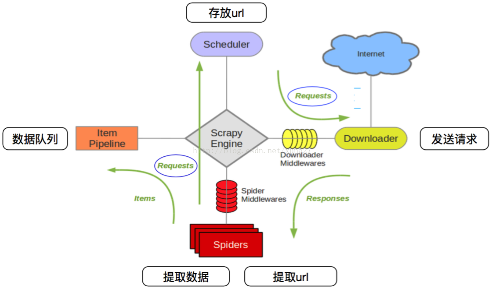
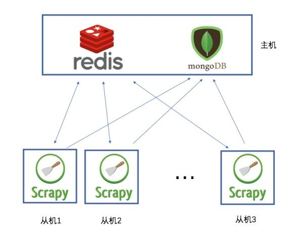

##爬虫常用库

requests、selenium、puppeteer，beautifulsoup4、pyquery、pymysql、pymongo、redis、lxml和scrapy框架

其中发起请求课可以使用requests和scrapy

解析内容可以用 beautifulsoup4,lxml,pyquery

存储内容可以使用 mysql(清洗后的数据) redis(代理池) mongodb(未清洗的数据)

抓取动态渲染的内容可以使用:selenium,puppeteer


##增量爬虫

一个网站，本来一共有10页，过段时间之后变成了100页。假设，已经爬取了前10页，为了增量爬取，我们现在只想爬取第11-100页。

因此，为了增量爬取，我们需要将前10页请求的指纹保存下来。以下命令是将内存中的set里指纹保存到本地硬盘的一种方式。

```
scrapy crawl somespider -s JOBDIR=crawls/somespider-1 
```

但还有更常用的，是将scrapy中的指纹存在一个redis数据库中，这个操作已经有造好轮子了，即scrapy-redis库。

scrapy-redis库将指纹保存在了redis数据库中，是可以持久保存的。（基于此，还可以实现分布式爬虫，那是另外一个用途了）scrapy-redis库不仅存储了已请求的指纹，还存储了带爬取的请求，这样无论这个爬虫如何重启，每次scrapy从redis中读取要爬取的队列，将爬取后的指纹存在redis中。如果要爬取的页面的指纹在redis中就忽略，不在就爬取。

##Scrapy 相关

scrapy基于twisted异步IO框架，downloader是多线程的。

但是，由于python使用GIL（全局解释器锁，保证同时只有一个线程在使用解释器），这极大限制了并行性，在处理运算密集型程序的时候，Python的多线程效果很差，而如果开多个线程进行耗时的IO操作时，Python的多线程才能发挥出更大的作用。（因为Python在进行长时IO操作时会释放GIL）
所以简单的说，scrapy是多线程的，不需要再设置了，由于目前版本python的特性，多线程地不是很完全，但实际测试scrapy效率还可以。

requests 是一个基本库，目前只能用来发送http请求，所以涉及爬虫的多线程或者协程需要自己定制编写

##Scrapy整体架构


•  引擎(Scrapy Engine)，用来处理整个系统的数据流处理，触发事务 。

•  调度器(Scheduler)，用来接受引擎发过来的请求，压入队列中，并在引擎再次请求的时候返回。  

•  下载器(Downloader)，用于下载网页内容，并将网页内容返回给蜘蛛。   

•  蜘蛛(Spiders)，蜘蛛是主要干活的，用它来制订特定域名或网页的解析规则。编写用于分析response并提取item(即获取到的item)或额外跟进的URL的类。每个spider负责处理一个特定(或一些)网站。   

•  项目管道(ItemPipeline)，负责处理有蜘蛛从网页中抽取的项目，他的主要任务是清晰、验证和存储数据。当页面被蜘蛛解析后，将被发送到项目管道，并经过几个特定的次序处理数据。  

•  下载器中间件(DownloaderMiddlewares)，位于Scrapy引擎和下载器之间的钩子框架，主要是处理Scrapy引擎与下载器之间的请求及响应。     

•  蜘蛛中间件(SpiderMiddlewares)，介于Scrapy引擎和蜘蛛之间的钩子框架，主要工作是处理蜘蛛的响应输入和请求输出。  

•  调度中间件(SchedulerMiddlewares)，介于Scrapy引擎和调度之间的中间件，从Scrapy引擎发送到调度的请求和响应。



爬取流程：上图绿线是数据流向，

首先从初始URL开始，Scheduler会将其交给Downloader进行下载，下载之后会交给Spider进行分析，

Spider分析出来的结果有两种：

一种是需要进一步抓取的链接，例如之前分析的“下一页”的链接，这些东西会被传回Scheduler；

另一种是需要保存的数据，它们则被送到Item Pipeline那里，那是对数据进行后期处理（详细分析、过滤、存储等）的地方。

另外，在数据流动的通道里还可以安装各种中间件，进行必要的处理。

##数据流（流程，类似抓取任务生命周期）

Scrapy中的数据流由执行引擎控制，其过程如下:

1.引擎打开一个网站(open adomain)，找到处理该网站的Spider并向该spider请求第一个要爬取的URL(s)。

2.引擎从Spider中获取到第一个要爬取的URL并在调度器(Scheduler)以Request调度。

3.引擎向调度器请求下一个要爬取的URL。

4.调度器返回下一个要爬取的URL给引擎，引擎将URL通过下载中间件(请求(request)方向)转发给下载器(Downloader)。

5.一旦页面下载完毕，下载器生成一个该页面的Response，并将其通过下载中间件(返回(response)方向)发送给引擎。    

6.引擎从下载器中接收到Response并通过Spider中间件(输入方向)发送给Spider处理。

7.Spider处理Response并返回爬取到的Item及(跟进的)新的Request给引擎。

8.引擎将(Spider返回的)爬取到的Item给ItemPipeline，将(Spider返回的)Request给调度器。

9.(从第二步)重复直到调度器中没有更多地request，引擎关闭该网站。


###安装

```
pip install Scrapy
```

缺少twisted装不上的直接去网上下载动态库：https://www.lfd.uci.edu/~gohlke/pythonlibs/#twisted

新建项目

```
scrapy startproject 'project_name'
```

scrapy 配置文件
```
#==>第一部分：基本配置<===
#1、项目名称，默认的USER_AGENT由它来构成，也作为日志记录的日志名
BOT_NAME = 'Amazon'

#2、爬虫应用路径
SPIDER_MODULES = ['Amazon.spiders']
NEWSPIDER_MODULE = 'Amazon.spiders'

#3、客户端User-Agent请求头
#USER_AGENT = 'Amazon (+http://www.yourdomain.com)'

#4、是否遵循爬虫协议
# Obey robots.txt rules
ROBOTSTXT_OBEY = False

#5、是否支持cookie，cookiejar进行操作cookie，默认开启
#COOKIES_ENABLED = False

#6、Telnet用于查看当前爬虫的信息，操作爬虫等...使用telnet ip port ，然后通过命令操作
#TELNETCONSOLE_ENABLED = False
#TELNETCONSOLE_HOST = '127.0.0.1'
#TELNETCONSOLE_PORT = [6023,]

#7、Scrapy发送HTTP请求默认使用的请求头
#DEFAULT_REQUEST_HEADERS = {
#   'Accept': 'text/html,application/xhtml+xml,application/xml;q=0.9,*/*;q=0.8',
#   'Accept-Language': 'en',
#}


#===>第二部分：并发与延迟<===
#1、下载器总共最大处理的并发请求数,默认值16
#CONCURRENT_REQUESTS = 32

#2、每个域名能够被执行的最大并发请求数目，默认值8
#CONCURRENT_REQUESTS_PER_DOMAIN = 16

#3、能够被单个IP处理的并发请求数，默认值0，代表无限制，需要注意两点
#I、如果不为零，那CONCURRENT_REQUESTS_PER_DOMAIN将被忽略，即并发数的限制是按照每个IP来计算，而不是每个域名
#II、该设置也影响DOWNLOAD_DELAY，如果该值不为零，那么DOWNLOAD_DELAY下载延迟是限制每个IP而不是每个域
#CONCURRENT_REQUESTS_PER_IP = 16

#4、如果没有开启智能限速，这个值就代表一个规定死的值，代表对同一网址延迟请求的秒数
#DOWNLOAD_DELAY = 3


#===>第三部分：智能限速/自动节流：AutoThrottle extension<===
#一：介绍
from scrapy.contrib.throttle import AutoThrottle #http://scrapy.readthedocs.io/en/latest/topics/autothrottle.html#topics-autothrottle
设置目标：
1、比使用默认的下载延迟对站点更好
2、自动调整scrapy到最佳的爬取速度，所以用户无需自己调整下载延迟到最佳状态。用户只需要定义允许最大并发的请求，剩下的事情由该扩展组件自动完成


#二：如何实现？
在Scrapy中，下载延迟是通过计算建立TCP连接到接收到HTTP包头(header)之间的时间来测量的。
注意，由于Scrapy可能在忙着处理spider的回调函数或者无法下载，因此在合作的多任务环境下准确测量这些延迟是十分苦难的。 不过，这些延迟仍然是对Scrapy(甚至是服务器)繁忙程度的合理测量，而这扩展就是以此为前提进行编写的。


#三：限速算法
自动限速算法基于以下规则调整下载延迟
#1、spiders开始时的下载延迟是基于AUTOTHROTTLE_START_DELAY的值
#2、当收到一个response，对目标站点的下载延迟=收到响应的延迟时间/AUTOTHROTTLE_TARGET_CONCURRENCY
#3、下一次请求的下载延迟就被设置成：对目标站点下载延迟时间和过去的下载延迟时间的平均值
#4、没有达到200个response则不允许降低延迟
#5、下载延迟不能变的比DOWNLOAD_DELAY更低或者比AUTOTHROTTLE_MAX_DELAY更高

#四：配置使用
#开启True，默认False
AUTOTHROTTLE_ENABLED = True
#起始的延迟
AUTOTHROTTLE_START_DELAY = 5
#最小延迟
DOWNLOAD_DELAY = 3
#最大延迟
AUTOTHROTTLE_MAX_DELAY = 10
#每秒并发请求数的平均值，不能高于 CONCURRENT_REQUESTS_PER_DOMAIN或CONCURRENT_REQUESTS_PER_IP，调高了则吞吐量增大强奸目标站点，调低了则对目标站点更加”礼貌“
#每个特定的时间点，scrapy并发请求的数目都可能高于或低于该值，这是爬虫视图达到的建议值而不是硬限制
AUTOTHROTTLE_TARGET_CONCURRENCY = 16.0
#调试
AUTOTHROTTLE_DEBUG = True
CONCURRENT_REQUESTS_PER_DOMAIN = 16
CONCURRENT_REQUESTS_PER_IP = 16


#===>第四部分：爬取深度与爬取方式<===
#1、爬虫允许的最大深度，可以通过meta查看当前深度；0表示无深度
# DEPTH_LIMIT = 3

#2、爬取时，0表示深度优先Lifo(默认)；1表示广度优先FiFo

# 后进先出，深度优先
# DEPTH_PRIORITY = 0
# SCHEDULER_DISK_QUEUE = 'scrapy.squeue.PickleLifoDiskQueue'
# SCHEDULER_MEMORY_QUEUE = 'scrapy.squeue.LifoMemoryQueue'
# 先进先出，广度优先

# DEPTH_PRIORITY = 1
# SCHEDULER_DISK_QUEUE = 'scrapy.squeue.PickleFifoDiskQueue'
# SCHEDULER_MEMORY_QUEUE = 'scrapy.squeue.FifoMemoryQueue'


#3、调度器队列
# SCHEDULER = 'scrapy.core.scheduler.Scheduler'
# from scrapy.core.scheduler import Scheduler

#4、访问URL去重
# DUPEFILTER_CLASS = 'step8_king.duplication.RepeatUrl'


#===>第五部分：中间件、Pipelines、扩展<===
#1、Enable or disable spider middlewares
# See http://scrapy.readthedocs.org/en/latest/topics/spider-middleware.html
#SPIDER_MIDDLEWARES = {
#    'Amazon.middlewares.AmazonSpiderMiddleware': 543,
#}

#2、Enable or disable downloader middlewares
# See http://scrapy.readthedocs.org/en/latest/topics/downloader-middleware.html
DOWNLOADER_MIDDLEWARES = {
   # 'Amazon.middlewares.DownMiddleware1': 543,
}

#3、Enable or disable extensions
# See http://scrapy.readthedocs.org/en/latest/topics/extensions.html
#EXTENSIONS = {
#    'scrapy.extensions.telnet.TelnetConsole': None,
#}

#4、Configure item pipelines
# See http://scrapy.readthedocs.org/en/latest/topics/item-pipeline.html
ITEM_PIPELINES = {
   # 'Amazon.pipelines.CustomPipeline': 200,
}


#===>第六部分：缓存<===
"""
1. 启用缓存
    目的用于将已经发送的请求或相应缓存下来，以便以后使用
    
    from scrapy.downloadermiddlewares.httpcache import HttpCacheMiddleware
    from scrapy.extensions.httpcache import DummyPolicy
    from scrapy.extensions.httpcache import FilesystemCacheStorage
"""
# 是否启用缓存策略
# HTTPCACHE_ENABLED = True

# 缓存策略：所有请求均缓存，下次在请求直接访问原来的缓存即可
# HTTPCACHE_POLICY = "scrapy.extensions.httpcache.DummyPolicy"
# 缓存策略：根据Http响应头：Cache-Control、Last-Modified 等进行缓存的策略
# HTTPCACHE_POLICY = "scrapy.extensions.httpcache.RFC2616Policy"

# 缓存超时时间
# HTTPCACHE_EXPIRATION_SECS = 0

# 缓存保存路径
# HTTPCACHE_DIR = 'httpcache'

# 缓存忽略的Http状态码
# HTTPCACHE_IGNORE_HTTP_CODES = []

# 缓存存储的插件
# HTTPCACHE_STORAGE = 'scrapy.extensions.httpcache.FilesystemCacheStorage'
```


新建抓取脚本
```
#导包
import scrapy
import os

#定义抓取类
class Test(scrapy.Spider):

    #定义爬虫名称，和命令行运行时的名称吻合
    name = "test"

    #定义头部信息
    haders = {
        'User-Agent': 'Mozilla/5.0 (X11; Linux x86_64) AppleWebKit/537.36 (KHTML, like Gecko) Ubuntu Chromium/73.0.3683.86 Chrome/73.0.3683.86 Safari/537.36'
    }

    #定义回调方法
    def parse(self, response):
        #将抓取页面保存为文件
        page = response.url.split("/")[-2]
        filename = 'test-%s.html' % page
        if not os.path.exists(filename):
            with open(filename, 'wb') as f:
                f.write(response.body)
        self.log('Saved file %s' % filename)


        #匹配规则

        content_left_div = response.xpath('//*[@id="content-left"]')
        content_list_div = content_left_div.xpath('./div')

        for content_div in content_list_div:
            yield {
                'author': content_div.xpath('./div/a[2]/h2/text()').get(),
                'content': content_div.xpath('./a/div/span/text()').getall(),
            }

    #定义列表方法
    def start_requests(self):
        urls = [
            'https://www.qiushibaike.com/text/page/1/',
            'https://www.qiushibaike.com/text/page/2/',
        ]
        for url in urls:
            #如果想使用代理 可以加入代理参数 meta
            #meta={'proxy': 'http://proxy.yourproxy:8001'}

            #抓取方法
            yield scrapy.Request(url=url, callback=self.parse,headers=self.haders)
```

执行抓取脚本  注意脚本名称和上文定义的name变量要吻合
```
scrapy crawl test
```

##scrapy 中间件

下载器中间件是介于Scrapy的request/response处理的钩子框架，是用于全局修改Scrapy request和response的一个轻量、底层的系统。

开发代理中间件

在爬虫开发中，更换代理IP是非常常见的情况，有时候每一次访问都需要随机选择一个代理IP来进行。

中间件本身是一个Python的类，只要爬虫每次访问网站之前都先“经过”这个类，它就能给请求换新的代理IP，这样就能实现动态改变代理。

在创建一个Scrapy工程以后，工程文件夹下会有一个middlewares.py文件

在middlewares.py中添加下面一段代码：

```
import random
from scrapy.conf import settings

class ProxyMiddleware(object):

    def process_request(self, request, spider):
        proxy = random.choice(settings['PROXIES'])
        request.meta['proxy'] = proxy
```

进入settings，开启中间件

```
DOWNLOADER_MIDDLEWARES = {
  'AdvanceSpider.middlewares.ProxyMiddleware': 543,
}
```

配置好后运行爬虫，scrapy会在每次请求之前随机分配一个代理，可以请求下面的网址查看是否用了代理

http://exercise.kingname.info/exercise_middleware_ip

##分布式爬虫

Scrapy-Redis是一个基于Redis的Scrapy分布式组件。它利用Redis对用于爬取的请求(Requests)进行存储和调度(Schedule)，并对爬取产生的项目(items)存储以供后续处理使用。scrapy-redi重写了scrapy一些比较关键的代码，将scrapy变成一个可以在多个主机上同时运行的分布式爬虫。

具体部署和使用攻略：https://v3u.cn/Index_a_id_83




说白了，就是使用redis来维护一个url队列,然后scrapy爬虫都连接这一个redis获取url,且当爬虫在redis处拿走了一个url后,redis会将这个url从队列中清除,保证不会被2个爬虫拿到同一个url,即使可能2个爬虫同时请求拿到同一个url,在返回结果的时候redis还会再做一次去重处理,所以这样就能达到分布式效果,我们拿一台主机做redis 队列,然后在其他主机上运行爬虫.且scrapy-redis会一直保持与redis的连接,所以即使当redis 队列中没有了url,爬虫会定时刷新请求,一旦当队列中有新的url后,爬虫就立即开始继续爬


##应对反爬

###headers头文件

有些网站对爬虫反感，对爬虫请求一律拒绝，这时候我们需要伪装成浏览器，通过修改http中的headers来实现

```
headers = {
            'Host': "bj.lianjia.com",
            'Accept': "text/html,application/xhtml+xml,application/xml;q=0.9,image/webp,*/*;q=0.8",
            'Accept-Encoding': "gzip, deflate, sdch",
            'Accept-Language': "zh-CN,zh;q=0.8",
            'User-Agent': "Mozilla/5.0 (Windows NT 10.0; WOW64) AppleWebKit/537.36 (KHTML, like Gecko) Chrome/54.0.2840.87 Safari/537.36",
            'Connection': "keep-alive",
        }
p = requests.get(url, headers=headers)
print(p.content.decode('utf-8'))
```

###伪造Cookie

模拟登陆

一般登录的过程都伴随有验证码，这里我们通过selenium自己构造post数据进行提交，将返回验证码图片的链接地址输出到控制台下，点击图片链接识别验证码，输入验证码并提交，完成登录

```
from selenium import webdriver
from selenium.webdriver.common.keys import Keys    #
from selenium.webdriver.support.ui import WebDriverWait   # WebDriverWait的作用是等待某个条件的满足之后再往后运行
from selenium.webdriver import ActionChains
import time
import sys
driver = webdriver.PhantomJS(executable_path='C:\PyCharm 2016.2.3\phantomjs\phantomjs.exe')  # 构造网页驱动

driver.get('https://www.zhihu.com/#signin')       # 打开网页
driver.find_element_by_xpath('//input[@name="password"]').send_keys('your_password')
driver.find_element_by_xpath('//input[@name="account"]').send_keys('your_account')
driver.get_screenshot_as_file('zhihu.jpg')                   # 截取当前页面的图片
input_solution = input('请输入验证码 :')
driver.find_element_by_xpath('//input[@name="captcha"]').send_keys(input_solution)
time.sleep(2)

driver.find_element_by_xpath('//form[@class="zu-side-login-box"]').submit()  # 表单的提交  表单的提交，即可以选择登录按钮然后使用click方法，也可以选择表单然后使用submit方法
sreach_widonw = driver.current_window_handle     # 用来定位当前页面
# driver.find_element_by_xpath('//button[@class="sign-button submit"]').click()
try:
    dr = WebDriverWait(driver,5)
    # dr.until(lambda the_driver: the_driver.find_element_by_xpath('//a[@class="zu-side-login-box"]').is_displayed())
    if driver.find_element_by_xpath('//*[@id="zh-top-link-home"]'):
        print('登录成功')
except:
    print('登录失败')
    driver.save_screenshot('screen_shoot.jpg')     #截取当前页面的图片
    sys.exit(0)
driver.quit()   #退出驱动
```

###代理ip

当爬取速度过快时，当请求次数过多时都面临ip被封的可能。因此使用代理也是必备的。

###代理池的概念

抓取市面上所有免费代理网站的ip，比如西刺代理，快代理等

代理池维护存储 redis 因为代理ip生命周期很短，属于热数据，不适合持久化存储

使用时随机取出一个代理ip使用

使用request加代理

```
import requests
proxies = { "http": "http://10.10.1.10:3128",
            "https": "http://10.10.1.10:1080",}
p = request.get("http://www.baidu.com", proxies = proxies)
print(p.content.decode('utf-8'))
```

##抓取App端数据

使用Charles抓包

软件地址 https://www.charlesproxy.com/download/

为什么选择Charles 跨平台，方便好用，可以抓取Android应用也可以抓取Ios

可以抓取http https

##抓取视频

使用三方库 you-get

配合Fiddler抓包来抓取视频流