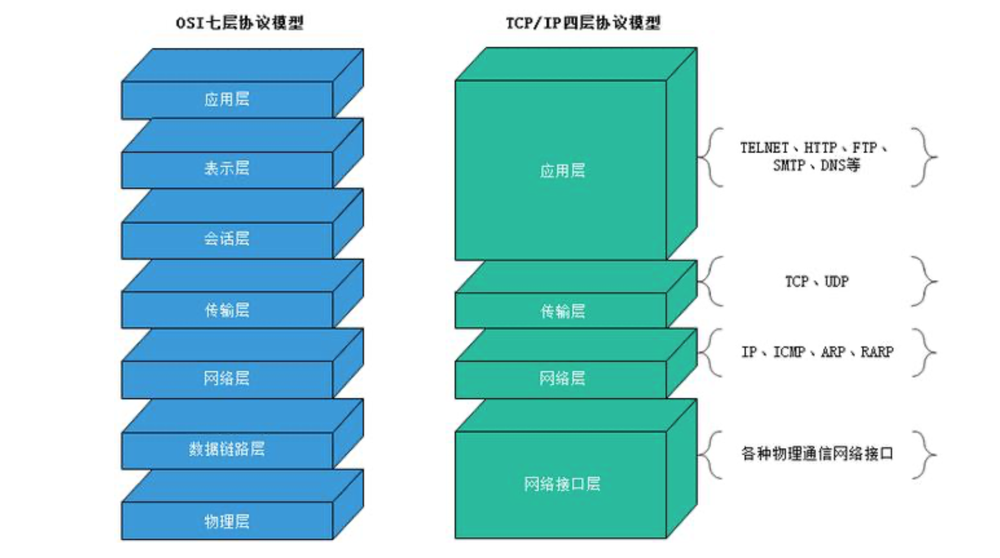

## 区别

1、udp是无连接的，tcp是面向连接的；2、udp是不可靠传输，tcp是可靠传输；3、udp是面向报文传输，tcp是面向字节流传输。

tcp相对安全完整准确性高

udp相对传输速度快

## 应用场景

像一些邮件收发的场景，要求数据完整性以及正确性，我们会使用基于tcp协议的smtp协议来实现

而一些要求传输速度层面的场景，比如在线视频播放，底层就是UDP协议，这是因为画质较低时，即使某些数据包丢失，我们也会忽略它们。

## 七层协议

## 实际场景

我要发一封邮件，目的地是北京地区某个email地址，我来到应用层，找到smtp协议，然后进入到表示层来进行处理，表示层将邮件进行编码和转码操作，此时进入会话层与主机进行通话，实际上会话层就是和服务器建立连接，建立连接后，进入传输层传输数据，传输层不仅负责传输，还得处理异常，比如丢包，在传输过程中，网络层起到规划路线的作用，相当于快递公司，到了北京之后，进入数据链路层，它相当于快递小哥，能够精准的将数据传送对应的设备，最后物理层做信号转换以及物理文件的传输。