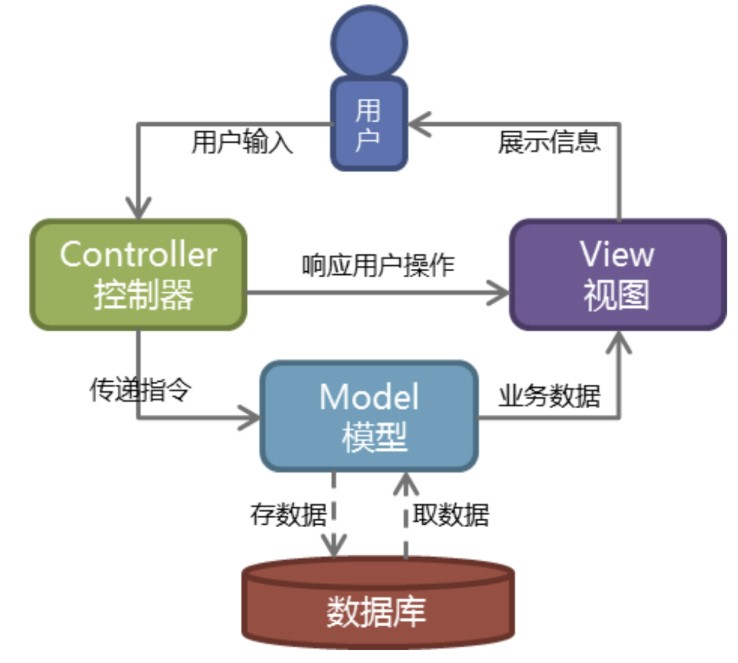

##TCP的三次握手

简单理解


深入理解


第一次握手：建立连接时，客户端发送syn包（syn=j）到服务器，并进入SYN_SENT状态，等待服务器确认；SYN：同步序列编号（Synchronize Sequence Numbers）。

第二次握手：服务器收到syn包，必须确认客户的SYN（ack=j+1），同时自己也发送一个SYN包（syn=k），即SYN+ACK包，此时服务器进入SYN_RECV状态；

第三次握手：客户端收到服务器的SYN+ACK包，向服务器发送确认包ACK(ack=k+1），此包发送完毕，客户端和服务器进入ESTABLISHED（TCP连接成功）状态，完成三次握手。

完成了三次握手，客户端和服务器端就可以开始传送数据。以上就是TCP三次握手的总体介绍。

##TCP的四次挥手

当客户端和服务器通过三次握手建立了TCP连接以后，当数据传送完毕，肯定是要断开TCP连接

那对于TCP的断开连接，这里就有了“四次挥手”


1）客户端进程发出连接释放报文，并且停止发送数据。释放数据报文首部，FIN=1，其序列号为seq=u（等于前面已经传送过来的数据的最后一个字节的序号加1），此时，客户端进入FIN-WAIT-1（终止等待1）状态。 TCP规定，FIN报文段即使不携带数据，也要消耗一个序号。

2）服务器收到连接释放报文，发出确认报文，ACK=1，ack=u+1，并且带上自己的序列号seq=v，此时，服务端就进入了CLOSE-WAIT（关闭等待）状态。TCP服务器通知高层的应用进程，客户端向服务器的方向就释放了，这时候处于半关闭状态，即客户端已经没有数据要发送了，但是服务器若发送数据，客户端依然要接受。这个状态还要持续一段时间，也就是整个CLOSE-WAIT状态持续的时间。

3）客户端收到服务器的确认请求后，此时，客户端就进入FIN-WAIT-2（终止等待2）状态，等待服务器发送连接释放报文（在这之前还需要接受服务器发送的最后的数据）。

4）服务器将最后的数据发送完毕后，就向客户端发送连接释放报文，FIN=1，ack=u+1，由于在半关闭状态，服务器很可能又发送了一些数据，假定此时的序列号为seq=w，此时，服务器就进入了LAST-ACK（最后确认）状态，等待客户端的确认。

5）客户端收到服务器的连接释放报文后，必须发出确认，ACK=1，ack=w+1，而自己的序列号是seq=u+1，此时，客户端就进入了TIME-WAIT（时间等待）状态。注意此时TCP连接还没有释放，必须经过2∗∗MSL（最长报文段寿命）的时间后，当客户端撤销相应的TCB后，才进入CLOSED状态。

6）服务器只要收到了客户端发出的确认，立即进入CLOSED状态。同样，撤销TCB后，就结束了这次的TCP连接。可以看到，服务器结束TCP连接的时间要比客户端早一些。


##业务模块描述

随着电子商务的发展，网上购物正在趋于一种时尚，电子商务网站也逐渐成为企业顺应潮流的标配。大多数人知道可能在电子商务网站前端有查询，注册登录，购物车等等功能。可是您知道建设电子商务网站后台功能模块都有哪些么?今天我们就聊聊电商网站后台功能模块的那些事。

电子商务网站整个系统的后端管理，按功能划分为九大模块，包括商品组织管理、订单处理、内容发布管理等模块。

一、后台主页： 
  各类主要信息的概要统计，包括客户信息、 订单信息、商品信息、库存信息、评论和最近反馈等。 

二、商品模块： 

 1.商品管理：商品和商品包的添加、修改、 删除、复制、批处理、商品计划上下架、SEO、商品多媒体上传等，可以定义商品是实体还是虚拟，可以定义是否预订、是否缺货销售等。

2.商品目录管理：树形的商品目录组织管理，并可以设置关联/商品推荐。   

3.商品类型管理：定义商品的类型，设置自定义属性项、SKU项和商品评论项。  

4.品牌管理：添加、修改、删除、上传品牌 LOGO。   

5.商品评论管理：回复、删除。

三、销售模块： 
  1.促销管理：分为目录促销、购物车促销和 优惠券促销三类，可以随意定义不同的促销规则，满足日常促销活动：购物折扣、购物赠送积分、购物赠送优惠券、购物免运输费、特价商品、特定会员购买特定商品、折上折、买二送一等。   2.礼券管理：添加、发送礼券 

  3.关联/推荐管理――基于规则引擎，可以支持多种推荐类型，可手工添加或者自动评估商品。

四、订单模块： 

  1.订单管理：可以编辑、解锁、取消订单、 拆分订单、添加商品、移除商品、确认可备货等，也可对因促销规则发生变化引起的价格变化进行调整。订单处理完可发起退货、换货流程。 

  2.支付：常用于订单支付信息的查看和手工 支付两种功能。手工支付订单，常用于“款到发货”类型的订单，可理解为对款到发货这类订单的一种补登行为。 

  3.结算：提供商家与第三方物流公司的结算 功能，通常是月结。同时，结算功能也是常用来对“货到付款”这一类型订单支付后的数据进行对帐

五、库存模块： 

  1.库存管理：引入库存的概念，不包括销售 规则为永远可售的商品，一个SKU对应一个库存量。库存管理提供增加、减少等调整库存量的功能;另外，也可对具具体的SKU设置商品的保留数量、***小库存量、再进货数量。每条SKU商品的具体库存操作都会记录在库存明细记录里边。

2.查看库存明细记录。 

  3.备货/发货：创建备货单、打印备货单、打印发货单、打印EMS快递单、完成发货等一系列物流配送的操作。 

  4.退/换货：对退/换货的订单进行收货流程的处理。

六、内容模块： 

  1.内容管理：包括内容管理以及内容目录管理。内容目录由树形结构组织管理。类似于商品目录的树形结构，可设置目录是否为链接目录。   

2.无限制创建独立内容网页，比如关于我们，联系我们。 

   3.广告管理：添加、修改、删除、上传广告、 定义广告有效时限。 

4.可自由设置商城导航栏目以及栏目内容、栏目链接。

七、客户模块： 

  1.客户管理：添加、删除、修改、重设密码、 发送邮件等。   2.反馈管理：删除、回复。 

  3.消息订阅管理：添加、删除、修改消息组 和消息、分配消息组、查看订阅人。   4.会员资格：添加、删除、修改。

八、系统模块： 

  1.安全管理：管理员、角色权限分配和安全日志 

  2.系统属性管理：用于管理自定义属性。可关联模块包括商品管理、商品目录管理、内容管理、客户管理。

3.运输与区域：运输公司、运输方式、运输 地区。   4.支付管理：支付方式、支付历史。   5.包装管理：添加、修改、删除。 

  6.数据导入管理：商品目录导入、商品导入、 会员资料导入。   7.邮件队列管理：监控邮件发送情况，删除 发送异常邮件。

九、报表模块： 

  缺省数个统计报表，支持时间段过滤、支持按不同状态过滤、支持HTML、PDF和Excel格式的导出和打印。   1.用户注册统计   2.低库存汇总   3.缺货订单   4.订单汇总   5.退换货


##Tornado 异步非阻塞框架

具体操作：https://v3u.cn/Index_a_id_89

Tornado是一个用Python编写的异步HTTP服务器，同时也是一个web开发框架。

Tornado 优秀的大并发处理能力得益于它的 web server 从底层开始就自己实现了一整套基于 epoll 的单线程异步架构。


###一个普通的tornado web服务器通常由四大组件组成。

ioloop实例，它是全局的tornado事件循环，是服务器的引擎核心，示例中tornado.ioloop.IOLoop.current()就是默认的tornado ioloop实例。

app实例，它代表着一个完成的后端app，它会挂接一个服务端套接字端口对外提供服务。一个ioloop实例里面可以有多个app实例，示例中只有1个，实际上可以允许多个，不过一般几乎不会使用多个。

handler类，它代表着业务逻辑，我们进行服务端开发时就是编写一堆一堆的handler用来服务客户端请求。

路由表，它将指定的url规则和handler挂接起来，形成一个路由映射表。当请求到来时，根据请求的访问url查询路由映射表来找到相应的业务handler。

这四大组件的关系是，一个ioloop包含多个app(管理多个服务端口)，一个app包含一个路由表，一个路由表包含多个handler。ioloop是服务的引擎核心，它是发动机，负责接收和响应客户端请求，负责驱动业务handler的运行，负责服务器内部定时任务的执行。当一个请求到来时，ioloop读取这个请求解包成一个http请求对象，找到该套接字上对应app的路由表，通过请求对象的url查询路由表中挂接的handler，然后执行handler。handler方法执行后一般会返回一个对象，ioloop负责将对象包装成http响应对象序列化发送给客户端。

###同步、异步编程差异：

你打电话问书店老板有没有《python开发》这本书，如果是同步通信机制，书店老板会说，你稍等，”我查一下"，然后开始查啊查，等查好了（可能是5秒，也可能是一天）告诉你结果（返回结果）。

而异步通信机制，书店老板直接告诉你我查一下啊，查好了打电话给你，然后直接挂电话了（不返回结果）。然后查好了，他会主动打电话给你。在这里老板通过“回电”这种方式来回调。

###阻塞与非阻塞的差异：

还是你打电话问书店老板有没有《python开发》这本书，你如果是阻塞式调用，你会一直把自己“挂起”，直到得到这本书有没有的结果

如果是非阻塞式调用，你不管老板有没有告诉你，你自己先一边去干别的了， 当然你也要偶尔过几分钟check一下老板有没有返回结果。


大部分Web应用都是阻塞性质的，也就是说当一个请求被处理时，这个进程就会被挂起直至请求完成，比如Django,而Tornado的思想是当我们在等待结果的时候不阻塞，转而我们给框架一个回调函数作为参数，让框架在收到结果的时候通过回调函数继续操作。这样，服务器就可以被解放去接受其他客户端的请求了。


##get和post区别

GET在浏览器回退时是无害的，而POST会再次提交请求。

GET产生的URL地址可以被Bookmark，而POST不可以。

GET请求会被浏览器主动cache，而POST不会，除非手动设置。

GET请求只能进行url编码，而POST支持多种编码方式。

GET请求参数会被完整保留在浏览器历史记录里，而POST中的参数不会被保留。

GET请求在URL中传送的参数是有长度限制的，而POST么有。

对参数的数据类型，GET只接受ASCII字符，而POST没有限制。

GET比POST更不安全，因为参数直接暴露在URL上，所以不能用来传递敏感信息。

GET参数通过URL传递，POST放在Request body中。

##简述MVC模式和MVT模式

所谓MVC就是把Web应用分为模型(M)，控制器(C)和视图(V)三层,他们之间以一种插件式的、松耦合的方式连接在一起，模型负责业务对象与数据库的映射(ORM)，视图负责与用户的交互(页面)，控制器接受用户的输入调用模型和视图完成用户的请求



Django的MTV模式本质上和MVC是一样的，也是为了各组件间保持松耦合关系，只是定义上有些许不同，Django的MTV分别是值：

M 代表模型（Model）： 负责业务对象和数据库的关系映射(ORM)。

T 代表模板 (Template)：负责如何把页面展示给用户(html)。

V 代表视图（View）： 负责业务逻辑，并在适当时候调用Model和Template。

除了以上三层之外，还需要一个URL分发器，它的作用是将一个个URL的页面请求分发给不同的View处理，View再调用相应的Model和Template


##HTTP 与 HTTPS 的区别


HTTP（HyperText Transfer Protocol：超文本传输协议）是一种用于分布式、协作式和超媒体信息系统的应用层协议。 简单来说就是一种发布和接收 HTML 页面的方法，被用于在 Web 浏览器和网站服务器之间传递信息。HTTP 默认工作在 TCP 协议 80 端口，用户访问网站 http:// 打头的都是标准 HTTP 服务。HTTP 协议以明文方式发送内容，不提供任何方式的数据加密，如果攻击者截取了Web浏览器和网站服务器之间的传输报文，就可以直接读懂其中的信息，因此，HTTP协议不适合传输一些敏感信息，比如：信用卡号、密码等支付信息。

HTTPS（Hypertext Transfer Protocol Secure：超文本传输安全协议）是一种透过计算机网络进行安全通信的传输协议。HTTPS 经由 HTTP 进行通信，但利用 SSL/TLS 来加密数据包。HTTPS 开发的主要目的，是提供对网站服务器的身份认证，保护交换数据的隐私与完整性。HTTPS 默认工作在 TCP 协议443端口，它的工作流程一般如以下方式：1、TCP 三次同步握手2、客户端验证服务器数字证书3、DH 算法协商对称加密算法的密钥、hash 算法的密钥4、SSL 安全加密隧道协商完成5、网页以加密的方式传输，用协商的对称加密算法和密钥加密，保证数据机密性；用协商的hash算法进行数据完整性保护，保证数据不被篡改。

区别：

HTTP 明文传输，数据都是未加密的，安全性较差，HTTPS（SSL+HTTP） 数据传输过程是加密的，安全性较好。

使用 HTTPS 协议需要到 CA（Certificate Authority，数字证书认证机构） 申请证书，一般免费证书较少，因而需要一定费用。证书颁发机构如：Symantec、Comodo、GoDaddy 和 GlobalSign 等。

HTTP 页面响应速度比 HTTPS 快，主要是因为 HTTP 使用 TCP 三次握手建立连接，客户端和服务器需要交换 3 个包，而 HTTPS除了 TCP 的三个包，还要加上 ssl 握手需要的 9 个包，所以一共是 12 个包。

http 和 https 使用的是完全不同的连接方式，用的端口也不一样，前者是 80，后者是 443。

HTTPS 其实就是建构在 SSL/TLS 之上的 HTTP 协议，所以，要比较 HTTPS 比 HTTP 要更耗费服务器资源。

##IPv6与IPv4的区别主要有以下几点：

1.IPv6的地址空间更大。IPv4中规定IP地址长度为32,即有2^32-1个地址；而IPv6中IP地址的长度为128,即有2^128-1个地址。夸张点说就是，如果IPV6被广泛应用以后，全世界的每一粒沙子都会有相对应的一个IP地址。

2.IPv6的路由表更小。IPv6的地址分配一开始就遵循聚类(Aggregation)的原则,这使得路由器能在路由表中用一条记录(Entry)表示一片子网,大大减小了路由器中路由表的长度,提高了路由器转发数据包的速度。

3.IPv6的组播支持以及对流的支持增强。这使得网络上的多媒体应用有了长足发展的机会，为服务质量控制提供了良好的网络平台。

4.IPv6加入了对自动配置的支持。这是对DHCP协议的改进和扩展，使得网络(尤其是局域网)的管理更加方便和快捷。

5.IPv6具有更高的安全性。在使用IPv6网络中，用户可以对网络层的数据进行加密并对IP报文进行校验，这极大地增强了网络安全。

6.允许扩充。如果新的技术或应用需要时，IPV6允许协议进行扩充。

7.更好的头部格式。IPV6使用新的头部格式，其选项与基本头部分开，如果需要，可将选项插入到基本头部与上层数据之间。这就简化和加速了路由选择过程，因为大多数的选项不需要由路由选择。

8.新的选项。IPV6有一些新的选项来实现附加的功能。


##websocket

WebSocket是HTML5下一种新的协议。它实现了浏览器与服务器全双工通信，能更好的节省服务器资源和带宽并达到实时通讯的目的。

它与HTTP一样通过已建立的TCP连接来传输数据，但是它和HTTP最大不同是：WebSocket是一种双向通信协议。在建立连接后，WebSocket服务器端和客户端都能主动向对方发送或接收数据，就像Socket一样；WebSocket需要像TCP一样，先建立连接，连接成功后才能相互通信。

传统HTTP客户端与服务器请求响应模式如下图所示：


WebSocket模式客户端与服务器请求响应模式如下


对比可以看出，相对于传统HTTP每次请求-应答都需要客户端与服务端建立连接的模式，WebSocket是类似Socket的TCP长连接通讯模式。一旦WebSocket连接建立后，后续数据都以帧序列的形式传输。在客户端断开WebSocket连接或Server端中断连接前，不需要客户端和服务端重新发起连接请求。在海量并发及客户端与服务器交互负载流量大的情况下，极大的节省了网络带宽资源的消耗，有明显的性能优势，且客户端发送和接受消息是在同一个持久连接上发起，实时性优势明显。

相比HTTP长连接，WebSocket有以下特点：是真正的全双工方式，建立连接后客户端与服务器端是完全平等的，可以互相主动请求。而HTTP长连接基于HTTP，是传统的客户端对服务器发起请求的模式。HTTP长连接中，每次数据交换除了真正的数据部分外，服务器和客户端还要大量交换HTTP header，信息交换效率很低。Websocket协议通过第一个request建立了TCP连接之后，之后交换的数据都不需要发送 HTTP header就能交换数据，这显然和原有的HTTP协议有区别所以它需要对服务器和客户端都进行升级才能实现（主流浏览器都已支持HTML5）。此外还有 multiplexing、不同的URL可以复用同一个WebSocket连接等功能。这些都是HTTP长连接不能做到的。


##websocket心跳及重连机制

在使用websocket的过程中，有时候会遇到网络断开的情况，但是在网络断开的时候服务器端并没有触发onclose的事件。这样会有：服务器会继续向客户端发送多余的链接，并且这些数据还会丢失。所以就需要一种机制来检测客户端和服务端是否处于正常的链接状态。因此就有了websocket的心跳了。还有心跳，说明还活着，没有心跳说明已经挂掉了。


1. 为什么叫心跳包呢？

它就像心跳一样每隔固定的时间发一次，来告诉服务器，我还活着。

2. 心跳机制是？

心跳机制是每隔一段时间会向服务器发送一个数据包，告诉服务器自己还活着，同时客户端会确认服务器端是否还活着，如果还活着的话，就会回传一个数据包给客户端来确定服务器端也还活着，否则的话，有可能是网络断开连接了。需要重连

实现思路：

实现心跳检测的思路是：每隔一段固定的时间，向服务器端发送一个ping数据，如果在正常的情况下，服务器会返回一个pong给客户端，如果客户端通过
onmessage事件能监听到的话，说明请求正常，这里我们使用了一个定时器，每隔3秒的情况下，如果是网络断开的情况下，在指定的时间内服务器端并没有返回心跳响应消息，因此服务器端断开了，因此这个时候我们使用ws.close关闭连接，在一段时间后(在不同的浏览器下，时间是不一样的，firefox响应更快)，
可以通过 onclose事件监听到。因此在onclose事件内，我们可以调用 reconnect事件进行重连操作

```
function init() {
  ws.onclose = function () {
    console.log('链接关闭');
    reconnect(wsUrl);
  };
  ws.onerror = function() {
    console.log('发生异常了');
    reconnect(wsUrl);
  };
  ws.onopen = function () {
    //心跳检测重置
    heartCheck.start();
  };
  ws.onmessage = function (event) {
    //拿到任何消息都说明当前连接是正常的
    console.log('接收到消息');
    heartCheck.start();
  }
}

var lockReconnect = false;//避免重复连接
function reconnect(url) {
  if(lockReconnect) {
    return;
  };
  lockReconnect = true;
  //没连接上会一直重连，设置延迟避免请求过多
  tt && clearTimeout(tt);
  tt = setTimeout(function () {
    createWebSocket(url);
    lockReconnect = false;
  }, 4000);
}
```


##支付宝支付流程


支付采用了RSA加密签名的安全通信机制，开发者可以通过支付宝的公钥验证消息的来源，同时使用自己的私钥进行信息加密。RSA算法及数字签名机制是服务窗平台与开发者网关安全通信的基础。

关于数字签名机制无非就是下面这四步，归根结底就是为了提高安全性，毕竟涉及钱了，马虎不得：

第一、发方首先有一个公钥/私钥对，它将要签名的报文作为一个单向散列函数的输入，产生一个定长的散列码，一般称为消息摘要。
第二、使用发放的私钥对散列码进行加密生成签名。将报文和签名一同发出去。
第三、收方用和发放一样的散列函数对报文运算生成一个散列码，同时用发放的公钥对签名进行解密。
第四、如果收方计算得到的散列码和解密的签名一致，那么说明的确是发方对报文进行了签名而且报文在途中没有被篡改。


##CSRF


一.CSRF是什么？

　　CSRF（Cross-site request forgery），中文名称：跨站请求伪造，也被称为：one click attack/session riding，缩写为：CSRF/XSRF。

二.CSRF可以做什么？

　　你这可以这么理解CSRF攻击：攻击者盗用了你的身份，以你的名义发送恶意请求。CSRF能够做的事情包括：以你名义发送邮件，发消息，盗取你的账号，甚至于购买商品，虚拟货币转账......造成的问题包括：个人隐私泄露以及财产安全。

##SQL注入

SQL注入是属于注入式攻击，这种攻击是因为在项目中没有将代码与数据(比如用户敏感数据)隔离，在读取数据的时候，错误的将数据作为代码的一部分执行而导致的。

典型的例子就是当对SQL语句进行字符串拼接的时候，直接使用未转义的用户输入内容作为变量。这时，只要在sql语句的中间做修改，比如加上drop、delete等关键字，执行之后后果不堪设想。

说到这里，那么该怎么处理这种情况呢?三个方面：

1、过滤用户输入参数中的特殊字符，降低风险。

2、禁止通过字符串拼接sql语句，要严格使用参数绑定来传入参数。

3、合理使用数据库框架提供的机制。就比如Mybatis提供的传入参数的方式 #{}，禁止使用${}，后者相当于是字符串拼接sql，要使用参数化的语句。

总结下，就是要正确使用参数化绑定sql变量

##XSS

XSS：跨站脚本攻击，Cross-Site Scripting，为了和前端的css避免重名，简称为XSS，是指通过技术手段，向正常用户请求的HTML页面中插入恶意脚本，执行。

这种攻击主要是用于信息窃取和破坏等目的。比如2011年的微博XSS攻击事件，攻击者利用了微博发布功能中未对action-data漏洞做有效的过滤，在发布微博信息的时候带上了包含攻击脚本的URL，用户访问就会加载恶意脚本，导致大量用户被攻击。

关于防范XSS上，主要就是通过对用户输入的数据做过滤或者是转义，可以使用框架提供的工具类HtmlUtil。另外前端在浏览器展示数据的时候，要使用安全的API展示数据。比如使用innerText而不是innerHTML。

总结下，过滤html标签


##生产者消费者模型

生产者-消费者模式是一个十分经典的多线程并发协作的模式，弄懂生产者-消费者问题能够让我们对并发编程的理解加深。所谓生产者-消费者问题，实际上主要是包含了两类线程，一种是生产者线程用于生产数据，另一种是消费者线程用于消费数据，为了解耦生产者和消费者的关系，通常会采用共享的数据区域，就像是一个仓库，生产者生产数据之后直接放置在共享数据区中，并不需要关心消费者的行为；而消费者只需要从共享数据区中去获取数据，就不再需要关心生产者的行为。但是，这个共享数据区域中应该具备这样的线程间并发协作的功能：

如果共享数据区已满的话，阻塞生产者继续生产数据放置入内；
如果共享数据区为空的话，阻塞消费者继续消费数据；

生产者和消费者彼此之间不直接通讯，而通过阻塞队列来进行通讯，所以生产者生产完数据之后不用等待消费者处理，直接扔给阻塞队列，消费者不找生产者要数据，而是直接从阻塞队列里取，阻塞队列就相当于一个缓冲区，平衡了生产者和消费者的处理能力。


##celery

首先，明确为啥使用celery

Django的请求处理过程都是同步的无法实现异步任务，若要实现异步任务处理需要通过其他方式（前端的一般解决方案是ajax操作），而后台Celery就是不错的选择。倘若一个用户在执行某些操作需要等待很久才返回，这大大降低了网站的吞吐量。


celery 原理

Celery是由Python开发、简单、灵活、可靠的分布式任务队列，其本质是生产者消费者模型，生产者发送任务到消息队列，消费者负责处理任务。Celery侧重于实时操作，但对调度支持也很好，其每天可以处理数以百万计的任务。特点：

简单：熟悉celery的工作流程后，配置使用简单
高可用：当任务执行失败或执行过程中发生连接中断，celery会自动尝试重新执行任务
快速：一个单进程的celery每分钟可处理上百万个任务
灵活：几乎celery的各个组件都可以被扩展及自定制


工作原理：

任务模块Task包含异步任务和定时任务。其中，异步任务通常在业务逻辑中被触发并发往消息队列，而定时任务由Celery Beat进程周期性地将任务发往消息队列；
任务执行单元Worker实时监视消息队列获取队列中的任务执行；
Woker执行完任务后将结果保存在Backend中;

消息中间件Broker
　　消息中间件Broker官方提供了很多备选方案，支持RabbitMQ、Redis、Amazon SQS、MongoDB、Memcached 等，官方推荐RabbitMQ。

任务执行单元Worker
　　Worker是任务执行单元，负责从消息队列中取出任务执行，它可以启动一个或者多个，也可以启动在不同的机器节点，这就是其实现分布式的核心。

结果存储Backend
　　Backend结果存储官方也提供了诸多的存储方式支持：RabbitMQ、 Redis、Memcached,SQLAlchemy, Django ORM、Apache Cassandra、Elasticsearch。


Celery管理和监控功能是通过flower组件实现的，flower组件不仅仅提供监控功能，还提供HTTP API可实现对woker和task的管理。


##跨域问题

具体方案：https://v3u.cn/a_id_49

因为浏览器的同源策略规定某域下的客户端在没明确授权的情况下，不能读写另一个域的资源。而在实际开发中，前后端常常是相互分离的，并且前后端的项目部署也常常不在一个服务器内或者在一个服务器的不同端口下。前端想要获取后端的数据，就必须发起请求，如果不做一些处理，就会受到浏览器同源策略的约束。后端可以收到请求并返回数据，但是前端无法收到数据。


##Http状态码


2开头 （请求成功）表示成功处理了请求的状态代码。

200   （成功）  服务器已成功处理了请求。 通常，这表示服务器提供了请求的网页。 

201   （已创建）  请求成功并且服务器创建了新的资源。 

202   （已接受）  服务器已接受请求，但尚未处理。 

203   （非授权信息）  服务器已成功处理了请求，但返回的信息可能来自另一来源。 

204   （无内容）  服务器成功处理了请求，但没有返回任何内容。 

205   （重置内容） 服务器成功处理了请求，但没有返回任何内容。

206   （部分内容）  服务器成功处理了部分 GET 请求。

3开头 （请求被重定向）表示要完成请求，需要进一步操作。 通常，这些状态代码用来重定向。

300   （多种选择）  针对请求，服务器可执行多种操作。 服务器可根据请求者 (user agent) 选择一项操作，或提供操作列表供请求者选择。 

301   （永久移动）  请求的网页已永久移动到新位置。 服务器返回此响应（对 GET 或 HEAD 请求的响应）时，会自动将请求者转到新位置。

302   （临时移动）  服务器目前从不同位置的网页响应请求，但请求者应继续使用原有位置来进行以后的请求。

303   （查看其他位置） 请求者应当对不同的位置使用单独的 GET 请求来检索响应时，服务器返回此代码。

304   （未修改） 自从上次请求后，请求的网页未修改过。 服务器返回此响应时，不会返回网页内容。 

305   （使用代理） 请求者只能使用代理访问请求的网页。 如果服务器返回此响应，还表示请求者应使用代理。 

307   （临时重定向）  服务器目前从不同位置的网页响应请求，但请求者应继续使用原有位置来进行以后的请求。

4开头 （请求错误）这些状态代码表示请求可能出错，妨碍了服务器的处理。

400   （错误请求） 服务器不理解请求的语法。 

401   （未授权） 请求要求身份验证。 对于需要登录的网页，服务器可能返回此响应。 

403   （禁止） 服务器拒绝请求。

404   （未找到） 服务器找不到请求的网页。

405   （方法禁用） 禁用请求中指定的方法。 

406   （不接受） 无法使用请求的内容特性响应请求的网页。 

407   （需要代理授权） 此状态代码与 401（未授权）类似，但指定请求者应当授权使用代理。

408   （请求超时）  服务器等候请求时发生超时。 

409   （冲突）  服务器在完成请求时发生冲突。 服务器必须在响应中包含有关冲突的信息。 

410   （已删除）  如果请求的资源已永久删除，服务器就会返回此响应。 

411   （需要有效长度） 服务器不接受不含有效内容长度标头字段的请求。 

412   （未满足前提条件） 服务器未满足请求者在请求中设置的其中一个前提条件。 

413   （请求实体过大） 服务器无法处理请求，因为请求实体过大，超出服务器的处理能力。 

414   （请求的 URI 过长） 请求的 URI（通常为网址）过长，服务器无法处理。 

415   （不支持的媒体类型） 请求的格式不受请求页面的支持。 

416   （请求范围不符合要求） 如果页面无法提供请求的范围，则服务器会返回此状态代码。 

417   （未满足期望值） 服务器未满足"期望"请求标头字段的要求。

5开头（服务器错误）这些状态代码表示服务器在尝试处理请求时发生内部错误。 这些错误可能是服务器本身的错误，而不是请求出错。

500   （服务器内部错误）  服务器遇到错误，无法完成请求。 

501   （尚未实施） 服务器不具备完成请求的功能。 例如，服务器无法识别请求方法时可能会返回此代码。 

502   （错误网关） 服务器作为网关或代理，从上游服务器收到无效响应。 

503   （服务不可用） 服务器目前无法使用（由于超载或停机维护）。 通常，这只是暂时状态。 

504   （网关超时）  服务器作为网关或代理，但是没有及时从上游服务器收到请求。 

505   （HTTP 版本不受支持） 服务器不支持请求中所用的 HTTP 协议版本。


##32位和64位区别

1. 32位系统CPU一次可处理32位数据，即一次处理4个字节。

    64位系统CPU一次可处理64位数据，即一次处理8个字节。

    通俗一点说： 32位，就相当于你拥有32个工人，每次能完成32个工人的工作量

    64位，就相当于你拥有64个工人，每次能完成64个工人的工作量

    总结： 由32位系统过渡到64位系统，CPU处理数据能力提升了一倍。

2.  来说说寻址能力

     内存中一个地址占用8bit，即一个字节，32位cpu含有32根地址线，寻址能力为2的32次方个字节，相当于4G内存（所以，如果我们装32位系统，安装8G内存实际上是没有用的）。而64位cpu理论上寻址能力为2的64次方个字节，但目前硬件还达不到这个水准，当然我们用不了这么大的内存。
