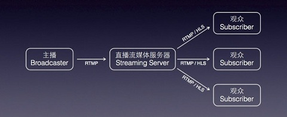

##直播原理

在视频直播领域，有不同的商家提供各种的商业解决方案，其中比较靠谱的服务商有阿里云直播，腾讯云直播，以及又拍云和网易云的有偿直播服务，服务包括软硬件设备，摄像机，编码器，流媒体服务器等

视频直播的流程可以分为如下几步： 

采集 —>处理—>编码和封装—>推流到服务器—>服务器流分发—>播放器流播放

一般情况下视频采集处理后推流到流媒体服务器，第一部分功能完成。第二部分就是流媒体服务器，负责把从第一部分接收到的流进行处理并分发给观众。第三部分就是客户端播放，只需要拥有支持流传输协议的播放器即可

应用技术点：

nginx-rtmp搭建直播服务器，配合FFmpeg推流，在网页端vue.js作为载体利用video.js作为流播放器

具体搭建：https://v3u.cn/a_id_75

##什么叫做“秒开” ？

秒开 即从视频播放开始到真正看到第一帧画面所消耗的时间要尽可能的短（几百毫秒时间），不能让观众有明显的等待时间

这种情况主要依靠第三方服务的优化以及播放器的配合，即依赖阿里云，腾讯云这种三方sdk的优化服务，最快可以实现 200ms 左右 的首屏打开速度，如果网络下行足够够好的话甚至可以秒开，如果是自研的推流服务和播放器则相对困难

##视频卡顿怎么办

卡顿的原因无外乎三种情况：

1 帧率太低

主播端的pc或者手机性能较差，或者有很占 CPU 的后台程序在运行，可能导致视频的帧率太低。正常情况下每秒15FPS以上的视频流才能保证观看的流畅度，如果 FPS 低于10帧，可以判定为帧率太低，这会导致全部观众的观看体验都很卡顿

2 上传阻塞

主播的pc或者手机在推流时会源源不断地产生音视频数据，但如果客户端上传网速太小，那么产生的音视频数据都会被堆积在主播的客户端里传不出去，上传阻塞会导致全部观众的观看体验都很卡顿

3 下行不佳

就是观众的下载带宽跟不上或者网络很波动，比如直播流的码率是1Mbps的，也就是每秒钟有1M比特的数据流要下载下来，但如果观众端的带宽不够，就会导致观众端体验非常卡顿。 下行不佳只会影响当前网络环境下的观众。

##如何降低延迟

按正常情况 RTMP 推流+FLV 播放的正常延迟在2秒 - 3秒左右，太长则是有问题的，如果您发现直播延迟时间特别长，可以按照如下思路来排查。

Step 1. 检查播放协议
不少客户播放协议采用 HLS（m3u8），并感觉延迟较大，这个是正常的。苹果主推的 HLS 是基于大颗粒的 TS 分片的流媒体协议，每个分片都有5s以上的时长，分片数量一般为3个 - 4个，所以总延迟在20s - 30s就不足为怪。
换用 FLV 作为播放协议即可解决这个问题，但是要注意，如果您要在手机浏览器上观看直播视频，只有 HLS（m3u8） 这一种播放协议可以选择，其它的直播协议在苹果的 Safari 浏览器上都是不支持的。

Step 2. 检查播放器设置

由于自研应用使用的开源播放器video.js，一些设置可以参考官方文档，如果希望更好的优化，还是建议使用成熟的付费第三方sdk，比如阿里云

Step 3. 后台不要打水印

众所周知，FFmpeg有推流打水印的功能，但是这种功能会严重影响直播视频的流畅度

Step 4. 检查 OBS 设置

有不少主播喜欢在pc上使用obs推流，播放端延迟比较大。建议调整配置对应的参数，并注意要把关键帧间隔设置为1或者2

##为何推流不成功

1 直播服务器是否正常启动

检查nginx服务是否正常启动，端口是否正在监听

2 网路是否正常？

RTMP 推流所使用的默认端口号是1935 ，如果您测试时所在网络的防火墙不允许1935端口通行，就会遇到连不上与服务器的问题。此时您可以通过切换网络（比如 4G ）来排查是不是这个原因导致的问题。

3 推流URL是否被占用？

一个推流 URL 同时只能有一个推流端，第二个尝试去推流的 Client 会被Nginx服务拒绝掉。

##兼容苹果Mac os

我们知道mac端的Safari浏览器可以直接播放m3u8格式的视频流，所以建议为mac端定制直播页面，降低开发成本
